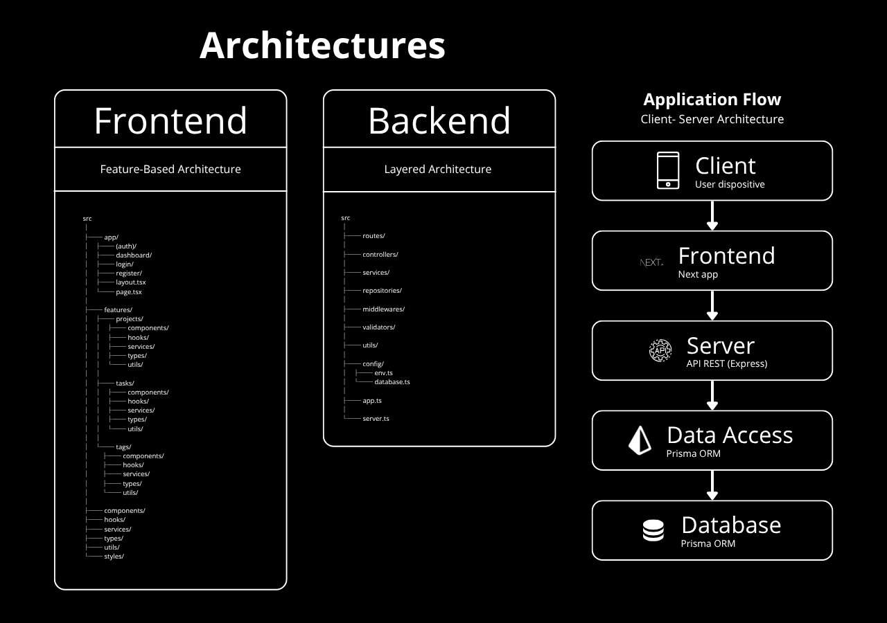

# Repository Structure

This document describes the organization of the repository and the responsibilities of its main directories and applications.

## Overview

The project uses a monorepo structure to maintain the frontend, backend, documentation, and development configuration within a single repository.

```text
project-root/
├── frontend/
├── backend/
├── docs/
├── .github/
├── .gitignore
├── package.json
└── ...
```



The frontend and backend are maintained as separate applications while sharing the same repository and version control history.

## Directory Structure

### `frontend/`

Contains the frontend application.

The frontend is responsible for the user interface, client-side behavior, navigation, form handling, and communication with the backend API.

The frontend is developed independently from the backend and has its own dependencies, configuration, and application code.

### `backend/`

Contains the backend application.

The backend is responsible for the API, business logic, authentication, validation, and access to persistent data.

The backend is developed independently from the frontend and has its own dependencies, configuration, and application code.

### `docs/`

Contains the project's technical documentation.

Documentation is organized by domain:

```text
docs/
├── api/
├── architecture/
├── database/
├── decisions/
├── development/
├── security/
├── der/
├── sequence-diagrams/
└── uml/
```

Each directory contains documentation related to a specific technical area of the system.

### `.github/`

Contains repository-level GitHub configuration.

This directory may include:

- GitHub Actions workflows.
- Issue templates.
- Pull request templates.
- Other GitHub-specific configuration.

## Application Independence

The frontend and backend are logically independent applications within the same repository.

Each application:

- Has its own source code.
- Manages its own dependencies.
- Has its own configuration.
- Can be developed and tested independently.
- Has a clearly defined responsibility within the system.

The monorepo provides a shared version control boundary without coupling the internal implementation of the applications.

## Shared Configuration

Repository-level configuration is maintained at the root when it applies to the project as a whole.

Application-specific configuration remains within the corresponding application directory.

This distinction prevents application-specific settings from being unnecessarily shared between the frontend and backend.

## Documentation and Development Resources

Project-wide documentation is maintained under `docs/`.

Repository-level development and automation configuration is maintained under `.github/`.

Application-specific configuration and source code remain within their respective application directories.

## Repository-Level Files

Files located at the repository root are used for project-wide configuration and metadata.

Examples include:

- `package.json`
- `.gitignore`
- Repository configuration files

These files should only contain configuration that applies to the repository as a whole.

## Related Documentation

- [System Overview](./system-overview.md): High-level system architecture and component relationships.
- [Frontend](./frontend.md): Frontend architecture and responsibilities.
- [Backend](./backend.md): Backend architecture and responsibilities.
