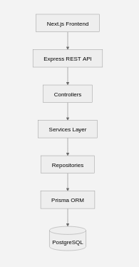

# System Overview

This document provides a high-level overview of the system architecture, its main components, their responsibilities, and the relationships between them.

## Project Architecture Overview

The following diagram represents the overall system structure and the communication flow between its main components.



## Main Components

### User

The user interacts with the system through the frontend application.

The user does not communicate directly with the backend infrastructure or database. All application interactions are handled through the frontend.

### Frontend

The frontend is responsible for the client-side application and user interface.

**Technology:**

- Next.js
- React
- TypeScript
- Tailwind CSS

**Responsibilities:**

- Render the user interface.
- Handle user interactions.
- Manage client-side application behavior.
- Collect and validate user input.
- Communicate with the backend API.
- Display data and application responses to the user.

The frontend does not access the database directly.

### Backend

The backend provides the server-side application and API consumed by the frontend.

**Technology:**

- Node.js
- Express
- TypeScript

**Responsibilities:**

- Expose the application API.
- Process incoming requests.
- Validate request data.
- Handle authentication and authorization.
- Execute business logic.
- Manage access to persistent data.
- Return appropriate responses to the frontend.

The backend acts as the main boundary between the client application and the persistence layer.

### Prisma

Prisma is used as the application's database access layer.

**Responsibilities:**

- Provide typed access to the database.
- Map application models to database entities.
- Execute database queries through the backend.
- Manage database schema and migrations.

The frontend does not interact with Prisma directly.

### PostgreSQL

PostgreSQL is the relational database used for persistent data storage.

**Responsibilities:**

- Store application data.
- Maintain data relationships and constraints.
- Ensure data persistence and consistency.

The database is accessed exclusively through the backend application using Prisma.

### Neon

Neon provides the PostgreSQL database infrastructure used by the system.

It hosts the project's PostgreSQL database and provides the persistence layer consumed by the backend through Prisma.

## Component Relationships

The main components interact through clearly defined boundaries:

```text
User
  │
  ▼
Frontend
  │
  │ HTTP / JSON
  ▼
Backend
  │
  │ Prisma
  ▼
PostgreSQL
  │
  │ Hosted by
  ▼
Neon
```

## Application Boundaries

The system follows a clear separation of responsibilities between its main layers.

### Presentation Layer

The frontend represents the presentation layer and is responsible for the user interface and client-side behavior.

### Application Layer

The backend represents the application layer and is responsible for API handling, authentication, validation, and business logic.

### Persistence Layer

Prisma and PostgreSQL form the persistence layer responsible for data access and storage.

These boundaries prevent individual components from taking responsibilities that belong to another layer.

## General Data Flow

A typical interaction follows this general flow:

1. The user performs an action through the frontend.
2. The frontend processes the interaction and sends an HTTP request to the backend.
3. The backend receives and validates the request.
4. The backend executes the required application logic.
5. If persistent data is required, the backend uses Prisma to interact with PostgreSQL.
6. PostgreSQL returns the requested data or operation result.
7. The backend processes the result and returns an HTTP response.
8. The frontend receives the response and updates the user interface.

This flow establishes the main communication boundary:

**User → Frontend → Backend → Prisma → PostgreSQL**

The reverse path is used to return the result:

**PostgreSQL → Prisma → Backend → Frontend → User**

## Architectural Boundaries

The following boundaries are maintained throughout the system:

- The user interacts only with the frontend.
- The frontend communicates with the backend through the API.
- The frontend does not access the database directly.
- The backend is responsible for business logic and data access.
- Prisma is used by the backend as the database access layer.
- PostgreSQL is responsible for persistent data storage.
- Infrastructure concerns are kept separate from application responsibilities.

These boundaries help maintain separation of concerns and allow each component to evolve independently.
