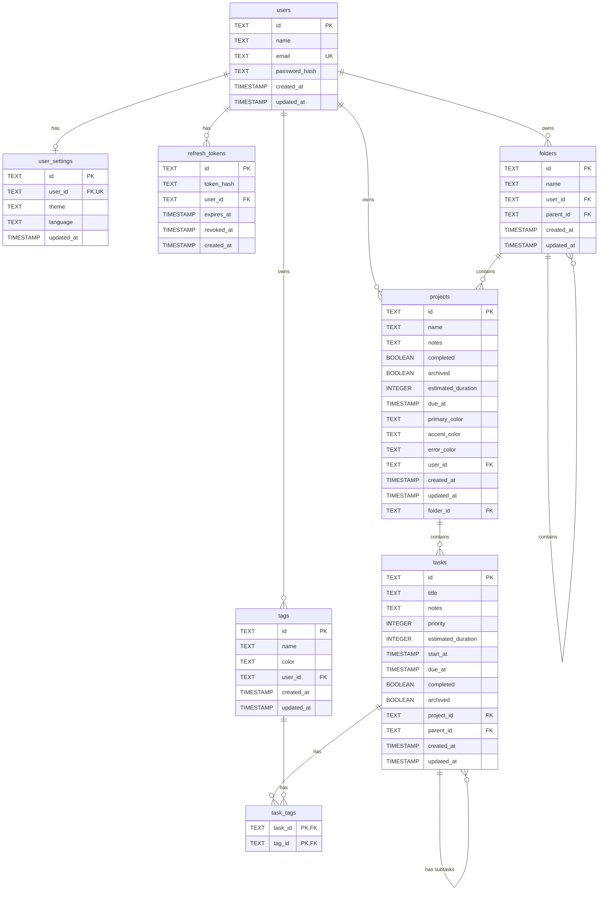

```mermaid
erDiagram

    users {
        TEXT id PK
        TEXT name
        TEXT email UK
        TEXT password_hash
        TIMESTAMP created_at
        TIMESTAMP updated_at
    }

    user_settings {
        TEXT id PK
        TEXT user_id FK,UK
        TEXT theme
        TEXT language
        TIMESTAMP updated_at
    }

    refresh_tokens {
        TEXT id PK
        TEXT token_hash
        TEXT user_id FK
        TIMESTAMP expires_at
        TIMESTAMP revoked_at
        TIMESTAMP created_at
    }

    projects {
        TEXT id PK
        TEXT name
        TEXT notes
        BOOLEAN completed
        BOOLEAN archived
        INTEGER estimated_duration
        TIMESTAMP due_at
        TEXT primary_color
        TEXT accent_color
        TEXT error_color
        TEXT user_id FK
        TIMESTAMP created_at
        TIMESTAMP updated_at
        TEXT folder_id FK
    }

    tasks {
        TEXT id PK
        TEXT title
        TEXT notes
        INTEGER priority
        INTEGER estimated_duration
        TIMESTAMP start_at
        TIMESTAMP due_at
        BOOLEAN completed
        BOOLEAN archived
        TEXT project_id FK
        TEXT parent_id FK
        TIMESTAMP created_at
        TIMESTAMP updated_at
    }

    tags {
        TEXT id PK
        TEXT name
        TEXT color
        TEXT user_id FK
        TIMESTAMP created_at
        TIMESTAMP updated_at
    }

    task_tags {
        TEXT task_id PK,FK
        TEXT tag_id PK,FK
    }

    folders {
        TEXT id PK
        TEXT name
        TEXT user_id FK
        TEXT parent_id FK
        TIMESTAMP created_at
        TIMESTAMP updated_at
    }

    users ||--o| user_settings : "has"
    users ||--o{ refresh_tokens : "has"
    users ||--o{ projects : "owns"
    users ||--o{ tags : "owns"
    users ||--o{ folders : "owns"

    folders ||--o{ projects : "contains"
    folders ||--o{ folders : "contains"

    projects ||--o{ tasks : "contains"

    tasks ||--o{ tasks : "has subtasks"

    tasks ||--o{ task_tags : "has"
    tags ||--o{ task_tags : "has"
```
