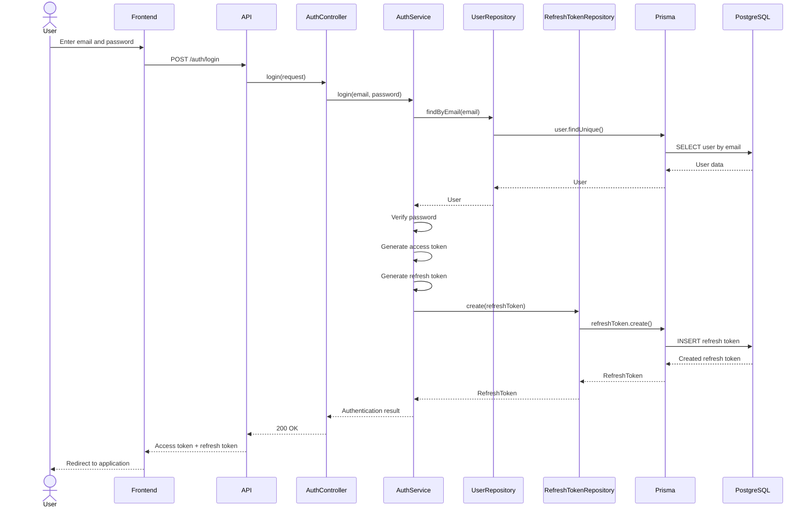

# Sequence Diagram - Auth - Login

```mermaid
sequenceDiagram
    actor User
    participant Frontend
    participant API
    participant AuthController
    participant AuthService
    participant UserRepository
    participant RefreshTokenRepository
    participant Prisma
    participant PostgreSQL

    User->>Frontend: Enter email and password
    Frontend->>API: POST /auth/login
    API->>AuthController: login(request)
    AuthController->>AuthService: login(email, password)

    AuthService->>UserRepository: findByEmail(email)
    UserRepository->>Prisma: user.findUnique()
    Prisma->>PostgreSQL: SELECT user by email
    PostgreSQL-->>Prisma: User data
    Prisma-->>UserRepository: User
    UserRepository-->>AuthService: User

    AuthService->>AuthService: Verify password
    AuthService->>AuthService: Generate access token
    AuthService->>AuthService: Generate refresh token
    AuthService->>RefreshTokenRepository: create(refreshToken)

    RefreshTokenRepository->>Prisma: refreshToken.create()
    Prisma->>PostgreSQL: INSERT refresh token
    PostgreSQL-->>Prisma: Created refresh token
    Prisma-->>RefreshTokenRepository: RefreshToken
    RefreshTokenRepository-->>AuthService: RefreshToken

    AuthService-->>AuthController: Authentication result
    AuthController-->>API: 200 OK
    API-->>Frontend: Access token + refresh token
    Frontend-->>User: Redirect to application
```
