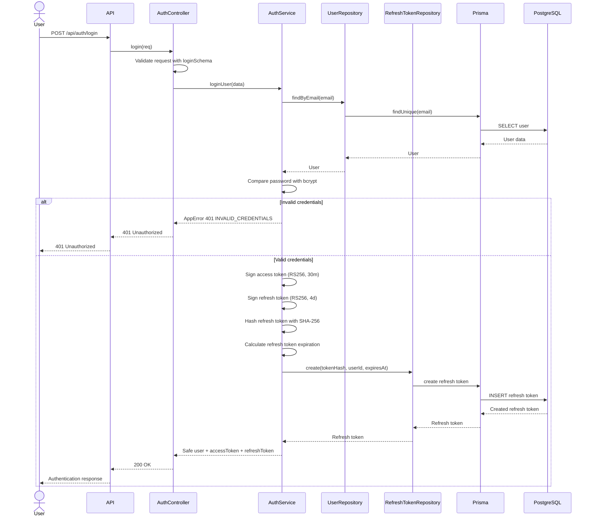

# Auth - Login

```mermaid
sequenceDiagram
    actor User
    participant API
    participant AuthController
    participant AuthService
    participant UserRepository
    participant RefreshTokenRepository
    participant Prisma
    participant PostgreSQL

    User->>API: POST /api/auth/login
    API->>AuthController: login(req)
    AuthController->>AuthController: Validate request with loginSchema
    AuthController->>AuthService: loginUser(data)

    AuthService->>UserRepository: findByEmail(email)
    UserRepository->>Prisma: findUnique(email)
    Prisma->>PostgreSQL: SELECT user
    PostgreSQL-->>Prisma: User data
    Prisma-->>UserRepository: User
    UserRepository-->>AuthService: User

    AuthService->>AuthService: Compare password with bcrypt

    alt Invalid credentials
        AuthService-->>AuthController: AppError 401 INVALID_CREDENTIALS
        AuthController-->>API: 401 Unauthorized
        API-->>User: 401 Unauthorized
    else Valid credentials
        AuthService->>AuthService: Sign access token (RS256, 30m)
        AuthService->>AuthService: Sign refresh token (RS256, 4d)
        AuthService->>AuthService: Hash refresh token with SHA-256
        AuthService->>AuthService: Calculate refresh token expiration

        AuthService->>RefreshTokenRepository: create(tokenHash, userId, expiresAt)
        RefreshTokenRepository->>Prisma: create refresh token
        Prisma->>PostgreSQL: INSERT refresh token
        PostgreSQL-->>Prisma: Created refresh token
        Prisma-->>RefreshTokenRepository: Refresh token
        RefreshTokenRepository-->>AuthService: Refresh token

        AuthService-->>AuthController: Safe user + accessToken + refreshToken
        AuthController-->>API: 200 OK
        API-->>User: Authentication response
    end
```
