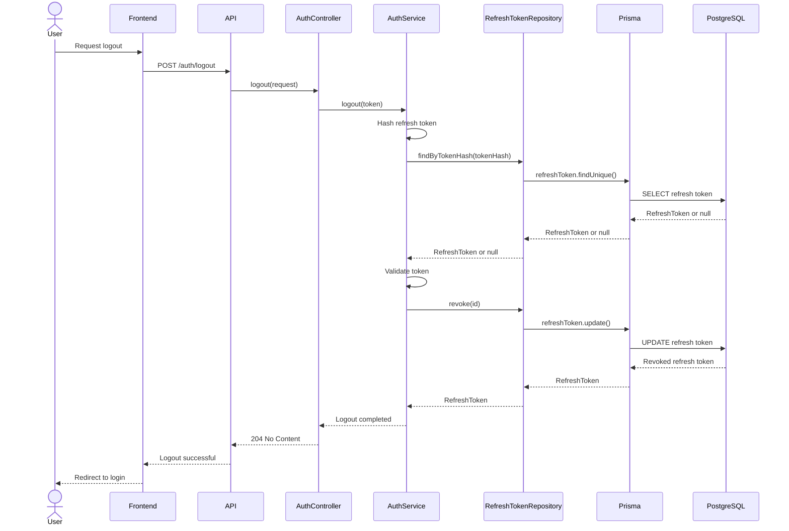

# Sequence Diagram - Auth - Logout

```mermaid
sequenceDiagram

    actor User

    participant Frontend

    participant API

    participant AuthController

    participant AuthService

    participant RefreshTokenRepository

    participant Prisma

    participant PostgreSQL

    User->>Frontend: Request logout

    Frontend->>API: POST /auth/logout

    API->>AuthController: logout(request)

    AuthController->>AuthService: logout(token)

    AuthService->>AuthService: Hash refresh token

    AuthService->>RefreshTokenRepository: findByTokenHash(tokenHash)

    RefreshTokenRepository->>Prisma: refreshToken.findUnique()

    Prisma->>PostgreSQL: SELECT refresh token

    PostgreSQL-->>Prisma: RefreshToken or null

    Prisma-->>RefreshTokenRepository: RefreshToken or null

    RefreshTokenRepository-->>AuthService: RefreshToken or null

    AuthService->>AuthService: Validate token

    AuthService->>RefreshTokenRepository: revoke(id)

    RefreshTokenRepository->>Prisma: refreshToken.update()

    Prisma->>PostgreSQL: UPDATE refresh token

    PostgreSQL-->>Prisma: Revoked refresh token

    Prisma-->>RefreshTokenRepository: RefreshToken

    RefreshTokenRepository-->>AuthService: RefreshToken

    AuthService-->>AuthController: Logout completed

    AuthController-->>API: 204 No Content

    API-->>Frontend: Logout successful

    Frontend-->>User: Redirect to login
```
