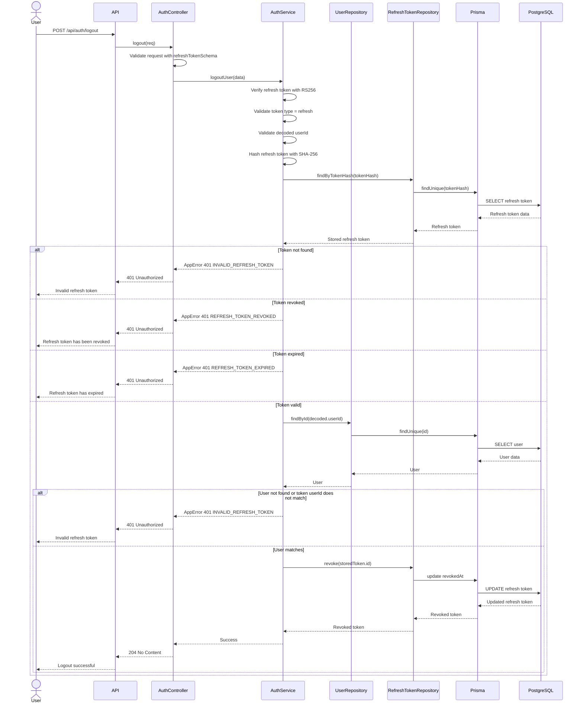

# Auth - Logout

```mermaid
sequenceDiagram
    actor User
    participant API
    participant AuthController
    participant AuthService
    participant UserRepository
    participant RefreshTokenRepository
    participant Prisma
    participant PostgreSQL

    User->>API: POST /api/auth/logout
    API->>AuthController: logout(req)
    AuthController->>AuthController: Validate request with refreshTokenSchema
    AuthController->>AuthService: logoutUser(data)

    AuthService->>AuthService: Verify refresh token with RS256
    AuthService->>AuthService: Validate token type = refresh
    AuthService->>AuthService: Validate decoded userId

    AuthService->>AuthService: Hash refresh token with SHA-256
    AuthService->>RefreshTokenRepository: findByTokenHash(tokenHash)
    RefreshTokenRepository->>Prisma: findUnique(tokenHash)
    Prisma->>PostgreSQL: SELECT refresh token
    PostgreSQL-->>Prisma: Refresh token data
    Prisma-->>RefreshTokenRepository: Refresh token
    RefreshTokenRepository-->>AuthService: Stored refresh token

    alt Token not found
        AuthService-->>AuthController: AppError 401 INVALID_REFRESH_TOKEN
        AuthController-->>API: 401 Unauthorized
        API-->>User: Invalid refresh token
    else Token revoked
        AuthService-->>AuthController: AppError 401 REFRESH_TOKEN_REVOKED
        AuthController-->>API: 401 Unauthorized
        API-->>User: Refresh token has been revoked
    else Token expired
        AuthService-->>AuthController: AppError 401 REFRESH_TOKEN_EXPIRED
        AuthController-->>API: 401 Unauthorized
        API-->>User: Refresh token has expired
    else Token valid
        AuthService->>UserRepository: findById(decoded.userId)
        UserRepository->>Prisma: findUnique(id)
        Prisma->>PostgreSQL: SELECT user
        PostgreSQL-->>Prisma: User data
        Prisma-->>UserRepository: User
        UserRepository-->>AuthService: User

        alt User not found or token userId does not match
            AuthService-->>AuthController: AppError 401 INVALID_REFRESH_TOKEN
            AuthController-->>API: 401 Unauthorized
            API-->>User: Invalid refresh token
        else User matches
            AuthService->>RefreshTokenRepository: revoke(storedToken.id)
            RefreshTokenRepository->>Prisma: update revokedAt
            Prisma->>PostgreSQL: UPDATE refresh token
            PostgreSQL-->>Prisma: Updated refresh token
            Prisma-->>RefreshTokenRepository: Revoked token
            RefreshTokenRepository-->>AuthService: Revoked token

            AuthService-->>AuthController: Success
            AuthController-->>API: 204 No Content
            API-->>User: Logout successful
        end
    end
```
