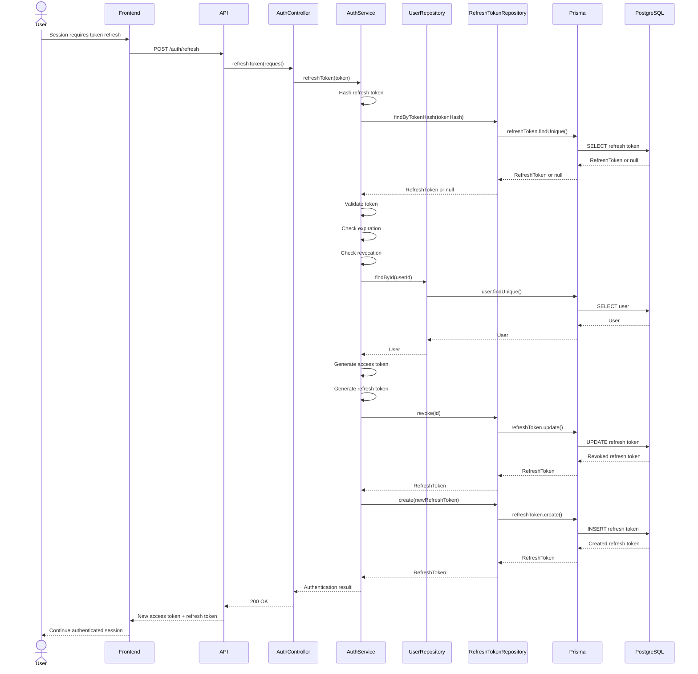

# Sequence Diagram - Auth - Refresh Token

```mermaid
sequenceDiagram

    actor User

    participant Frontend

    participant API

    participant AuthController

    participant AuthService

    participant UserRepository

    participant RefreshTokenRepository

    participant Prisma

    participant PostgreSQL

    User->>Frontend: Session requires token refresh

    Frontend->>API: POST /auth/refresh

    API->>AuthController: refreshToken(request)

    AuthController->>AuthService: refreshToken(token)

    AuthService->>AuthService: Hash refresh token

    AuthService->>RefreshTokenRepository: findByTokenHash(tokenHash)

    RefreshTokenRepository->>Prisma: refreshToken.findUnique()

    Prisma->>PostgreSQL: SELECT refresh token

    PostgreSQL-->>Prisma: RefreshToken or null

    Prisma-->>RefreshTokenRepository: RefreshToken or null

    RefreshTokenRepository-->>AuthService: RefreshToken or null

    AuthService->>AuthService: Validate token

    AuthService->>AuthService: Check expiration

    AuthService->>AuthService: Check revocation

    AuthService->>UserRepository: findById(userId)

    UserRepository->>Prisma: user.findUnique()

    Prisma->>PostgreSQL: SELECT user

    PostgreSQL-->>Prisma: User

    Prisma-->>UserRepository: User

    UserRepository-->>AuthService: User

    AuthService->>AuthService: Generate access token

    AuthService->>AuthService: Generate refresh token

    AuthService->>RefreshTokenRepository: revoke(id)

    RefreshTokenRepository->>Prisma: refreshToken.update()

    Prisma->>PostgreSQL: UPDATE refresh token

    PostgreSQL-->>Prisma: Revoked refresh token

    Prisma-->>RefreshTokenRepository: RefreshToken

    RefreshTokenRepository-->>AuthService: RefreshToken

    AuthService->>RefreshTokenRepository: create(newRefreshToken)

    RefreshTokenRepository->>Prisma: refreshToken.create()

    Prisma->>PostgreSQL: INSERT refresh token

    PostgreSQL-->>Prisma: Created refresh token

    Prisma-->>RefreshTokenRepository: RefreshToken

    RefreshTokenRepository-->>AuthService: RefreshToken

    AuthService-->>AuthController: Authentication result

    AuthController-->>API: 200 OK

    API-->>Frontend: New access token + refresh token

    Frontend-->>User: Continue authenticated session
```
