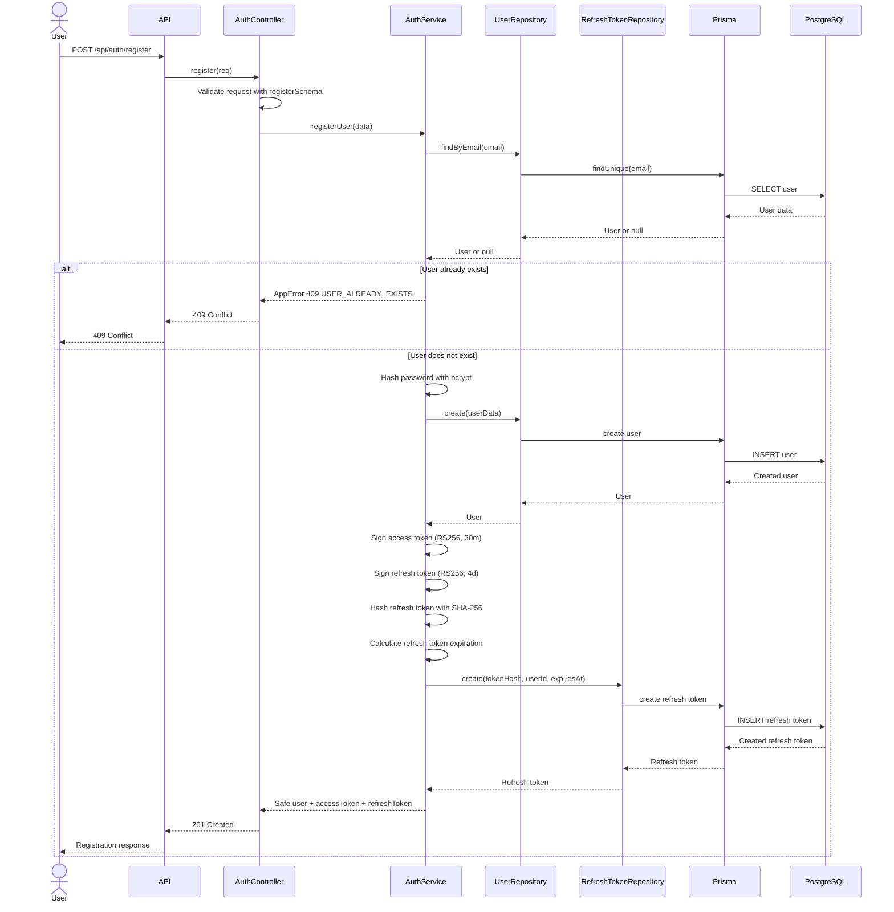

# Auth - Register User

```mermaid
sequenceDiagram
    actor User
    participant API
    participant AuthController
    participant AuthService
    participant UserRepository
    participant RefreshTokenRepository
    participant Prisma
    participant PostgreSQL

    User->>API: POST /api/auth/register
    API->>AuthController: register(req)
    AuthController->>AuthController: Validate request with registerSchema
    AuthController->>AuthService: registerUser(data)

    AuthService->>UserRepository: findByEmail(email)
    UserRepository->>Prisma: findUnique(email)
    Prisma->>PostgreSQL: SELECT user
    PostgreSQL-->>Prisma: User data
    Prisma-->>UserRepository: User or null
    UserRepository-->>AuthService: User or null

    alt User already exists
        AuthService-->>AuthController: AppError 409 USER_ALREADY_EXISTS
        AuthController-->>API: 409 Conflict
        API-->>User: 409 Conflict
    else User does not exist
        AuthService->>AuthService: Hash password with bcrypt
        AuthService->>UserRepository: create(userData)
        UserRepository->>Prisma: create user
        Prisma->>PostgreSQL: INSERT user
        PostgreSQL-->>Prisma: Created user
        Prisma-->>UserRepository: User
        UserRepository-->>AuthService: User

        AuthService->>AuthService: Sign access token (RS256, 30m)
        AuthService->>AuthService: Sign refresh token (RS256, 4d)
        AuthService->>AuthService: Hash refresh token with SHA-256
        AuthService->>AuthService: Calculate refresh token expiration

        AuthService->>RefreshTokenRepository: create(tokenHash, userId, expiresAt)
        RefreshTokenRepository->>Prisma: create refresh token
        Prisma->>PostgreSQL: INSERT refresh token
        PostgreSQL-->>Prisma: Created refresh token
        Prisma-->>RefreshTokenRepository: Refresh token
        RefreshTokenRepository-->>AuthService: Refresh token

        AuthService-->>AuthController: Safe user + accessToken + refreshToken
        AuthController-->>API: 201 Created
        API-->>User: Registration response
    end
```
