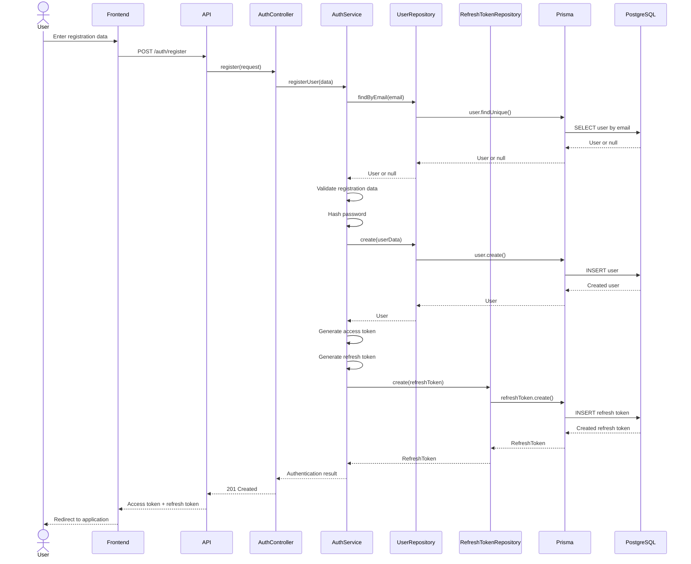

# Sequence Diagram - Auth - Register User

```mermaid
sequenceDiagram
    actor User
    participant Frontend
    participant API
    participant AuthController
    participant AuthService
    participant UserRepository
    participant RefreshTokenRepository
    participant Prisma
    participant PostgreSQL

    User->>Frontend: Enter registration data
    Frontend->>API: POST /auth/register
    API->>AuthController: register(request)
    AuthController->>AuthService: registerUser(data)

    AuthService->>UserRepository: findByEmail(email)
    UserRepository->>Prisma: user.findUnique()
    Prisma->>PostgreSQL: SELECT user by email
    PostgreSQL-->>Prisma: User or null
    Prisma-->>UserRepository: User or null
    UserRepository-->>AuthService: User or null

    AuthService->>AuthService: Validate registration data
    AuthService->>AuthService: Hash password

    AuthService->>UserRepository: create(userData)
    UserRepository->>Prisma: user.create()
    Prisma->>PostgreSQL: INSERT user
    PostgreSQL-->>Prisma: Created user
    Prisma-->>UserRepository: User
    UserRepository-->>AuthService: User

    AuthService->>AuthService: Generate access token
    AuthService->>AuthService: Generate refresh token

    AuthService->>RefreshTokenRepository: create(refreshToken)
    RefreshTokenRepository->>Prisma: refreshToken.create()
    Prisma->>PostgreSQL: INSERT refresh token
    PostgreSQL-->>Prisma: Created refresh token
    Prisma-->>RefreshTokenRepository: RefreshToken
    RefreshTokenRepository-->>AuthService: RefreshToken

    AuthService-->>AuthController: Authentication result
    AuthController-->>API: 201 Created
    API-->>Frontend: Access token + refresh token
    Frontend-->>User: Redirect to application
```
