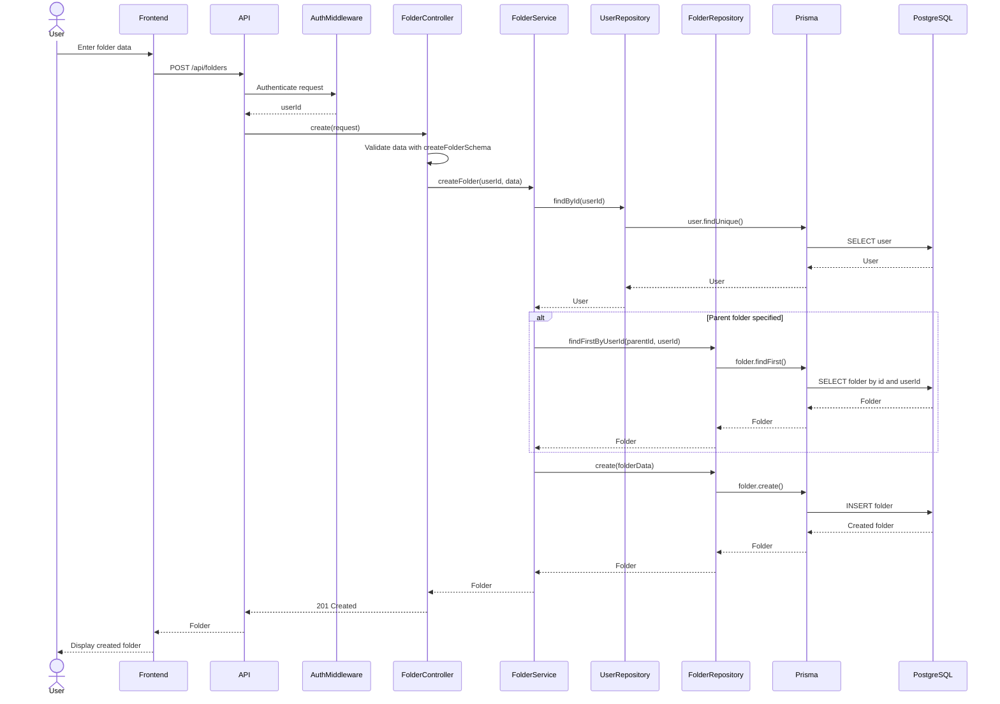

# Folder - Create

```mermaid
sequenceDiagram
    actor User
    participant Frontend
    participant API
    participant AuthMiddleware
    participant FolderController
    participant FolderService
    participant UserRepository
    participant FolderRepository
    participant Prisma
    participant PostgreSQL

    User->>Frontend: Enter folder data
    Frontend->>API: POST /api/folders
    API->>AuthMiddleware: Authenticate request
    AuthMiddleware-->>API: userId
    API->>FolderController: create(request)
    FolderController->>FolderController: Validate data with createFolderSchema
    FolderController->>FolderService: createFolder(userId, data)

    FolderService->>UserRepository: findById(userId)
    UserRepository->>Prisma: user.findUnique()
    Prisma->>PostgreSQL: SELECT user
    PostgreSQL-->>Prisma: User
    Prisma-->>UserRepository: User
    UserRepository-->>FolderService: User

    alt Parent folder specified
        FolderService->>FolderRepository: findFirstByUserId(parentId, userId)
        FolderRepository->>Prisma: folder.findFirst()
        Prisma->>PostgreSQL: SELECT folder by id and userId
        PostgreSQL-->>Prisma: Folder
        Prisma-->>FolderRepository: Folder
        FolderRepository-->>FolderService: Folder
    end

    FolderService->>FolderRepository: create(folderData)
    FolderRepository->>Prisma: folder.create()
    Prisma->>PostgreSQL: INSERT folder
    PostgreSQL-->>Prisma: Created folder
    Prisma-->>FolderRepository: Folder
    FolderRepository-->>FolderService: Folder
    FolderService-->>FolderController: Folder
    FolderController-->>API: 201 Created
    API-->>Frontend: Folder
    Frontend-->>User: Display created folder
```
