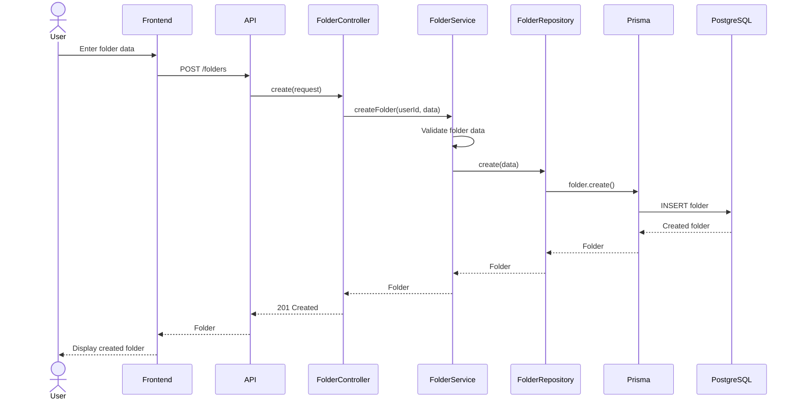

# Sequence Diagram - Folder - Create

```mermaid
sequenceDiagram

    actor User

    participant Frontend

    participant API

    participant FolderController

    participant FolderService

    participant FolderRepository

    participant Prisma

    participant PostgreSQL

    User->>Frontend: Enter folder data

    Frontend->>API: POST /folders

    API->>FolderController: create(request)

    FolderController->>FolderService: createFolder(userId, data)

    FolderService->>FolderService: Validate folder data

    FolderService->>FolderRepository: create(data)

    FolderRepository->>Prisma: folder.create()

    Prisma->>PostgreSQL: INSERT folder

    PostgreSQL-->>Prisma: Created folder

    Prisma-->>FolderRepository: Folder

    FolderRepository-->>FolderService: Folder

    FolderService-->>FolderController: Folder

    FolderController-->>API: 201 Created

    API-->>Frontend: Folder

    Frontend-->>User: Display created folder
```
