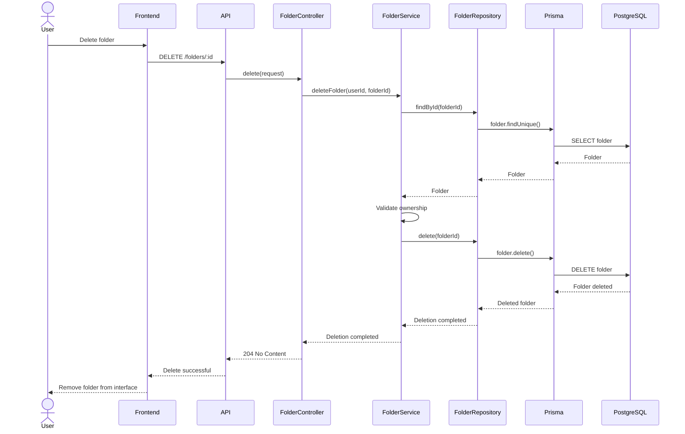

# Sequence Diagram - Folder - Delete

```mermaid
sequenceDiagram

    actor User

    participant Frontend

    participant API

    participant FolderController

    participant FolderService

    participant FolderRepository

    participant Prisma

    participant PostgreSQL

    User->>Frontend: Delete folder

    Frontend->>API: DELETE /folders/:id

    API->>FolderController: delete(request)

    FolderController->>FolderService: deleteFolder(userId, folderId)

    FolderService->>FolderRepository: findById(folderId)

    FolderRepository->>Prisma: folder.findUnique()

    Prisma->>PostgreSQL: SELECT folder

    PostgreSQL-->>Prisma: Folder

    Prisma-->>FolderRepository: Folder

    FolderRepository-->>FolderService: Folder

    FolderService->>FolderService: Validate ownership

    FolderService->>FolderRepository: delete(folderId)

    FolderRepository->>Prisma: folder.delete()

    Prisma->>PostgreSQL: DELETE folder

    PostgreSQL-->>Prisma: Folder deleted

    Prisma-->>FolderRepository: Deleted folder

    FolderRepository-->>FolderService: Deletion completed

    FolderService-->>FolderController: Deletion completed

    FolderController-->>API: 204 No Content

    API-->>Frontend: Delete successful

    Frontend-->>User: Remove folder from interface
```
