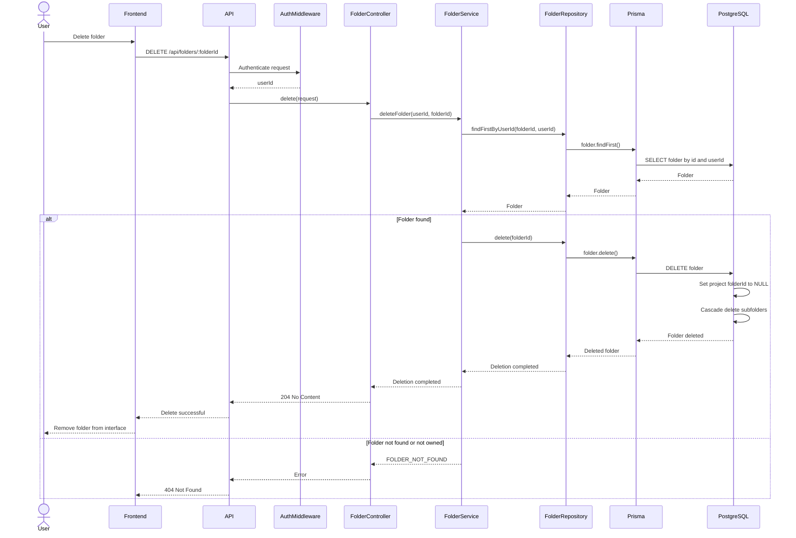

# Folder - Delete

```mermaid
sequenceDiagram
    actor User
    participant Frontend
    participant API
    participant AuthMiddleware
    participant FolderController
    participant FolderService
    participant FolderRepository
    participant Prisma
    participant PostgreSQL

    User->>Frontend: Delete folder
    Frontend->>API: DELETE /api/folders/:folderId
    API->>AuthMiddleware: Authenticate request
    AuthMiddleware-->>API: userId
    API->>FolderController: delete(request)
    FolderController->>FolderService: deleteFolder(userId, folderId)

    FolderService->>FolderRepository: findFirstByUserId(folderId, userId)
    FolderRepository->>Prisma: folder.findFirst()
    Prisma->>PostgreSQL: SELECT folder by id and userId
    PostgreSQL-->>Prisma: Folder
    Prisma-->>FolderRepository: Folder
    FolderRepository-->>FolderService: Folder

    alt Folder found
        FolderService->>FolderRepository: delete(folderId)
        FolderRepository->>Prisma: folder.delete()
        Prisma->>PostgreSQL: DELETE folder

        PostgreSQL->>PostgreSQL: Set project folderId to NULL
        PostgreSQL->>PostgreSQL: Cascade delete subfolders

        PostgreSQL-->>Prisma: Folder deleted
        Prisma-->>FolderRepository: Deleted folder
        FolderRepository-->>FolderService: Deletion completed
        FolderService-->>FolderController: Deletion completed
        FolderController-->>API: 204 No Content
        API-->>Frontend: Delete successful
        Frontend-->>User: Remove folder from interface

    else Folder not found or not owned
        FolderService-->>FolderController: FOLDER_NOT_FOUND
        FolderController-->>API: Error
        API-->>Frontend: 404 Not Found
    end
```
