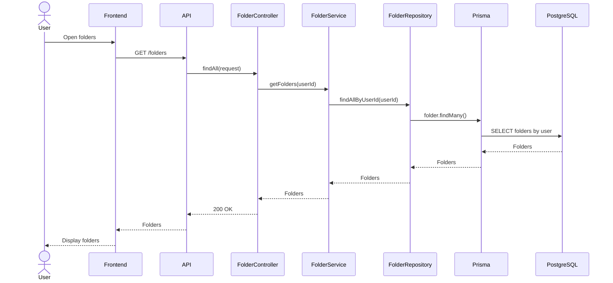
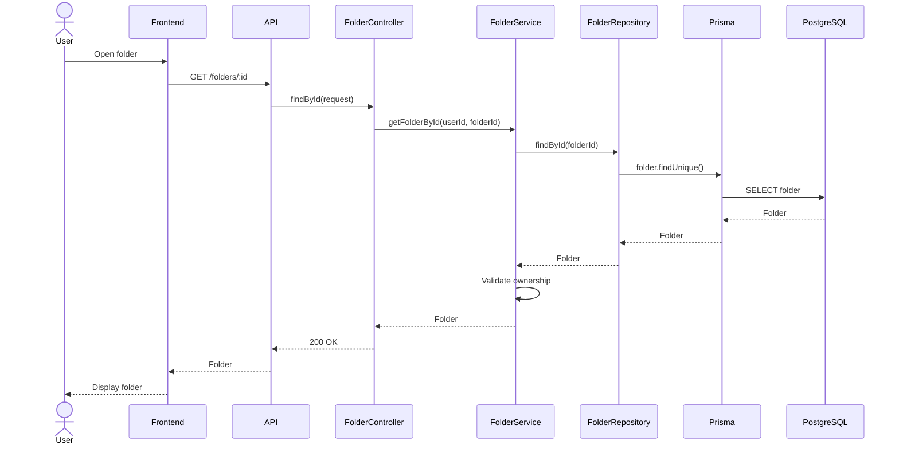

# Sequence Diagram - Folder - Get

## Get Folders

```mermaid
sequenceDiagram

    actor User

    participant Frontend

    participant API

    participant FolderController

    participant FolderService

    participant FolderRepository

    participant Prisma

    participant PostgreSQL

    User->>Frontend: Open folders

    Frontend->>API: GET /folders

    API->>FolderController: findAll(request)

    FolderController->>FolderService: getFolders(userId)

    FolderService->>FolderRepository: findAllByUserId(userId)

    FolderRepository->>Prisma: folder.findMany()

    Prisma->>PostgreSQL: SELECT folders by user

    PostgreSQL-->>Prisma: Folders

    Prisma-->>FolderRepository: Folders

    FolderRepository-->>FolderService: Folders

    FolderService-->>FolderController: Folders

    FolderController-->>API: 200 OK

    API-->>Frontend: Folders

    Frontend-->>User: Display folders
```

## Get Folder

```mermaid
sequenceDiagram

    actor User

    participant Frontend

    participant API

    participant FolderController

    participant FolderService

    participant FolderRepository

    participant Prisma

    participant PostgreSQL

    User->>Frontend: Open folder

    Frontend->>API: GET /folders/:id

    API->>FolderController: findById(request)

    FolderController->>FolderService: getFolderById(userId, folderId)

    FolderService->>FolderRepository: findById(folderId)

    FolderRepository->>Prisma: folder.findUnique()

    Prisma->>PostgreSQL: SELECT folder

    PostgreSQL-->>Prisma: Folder

    Prisma-->>FolderRepository: Folder

    FolderRepository-->>FolderService: Folder

    FolderService->>FolderService: Validate ownership

    FolderService-->>FolderController: Folder

    FolderController-->>API: 200 OK

    API-->>Frontend: Folder

    Frontend-->>User: Display folder
```
