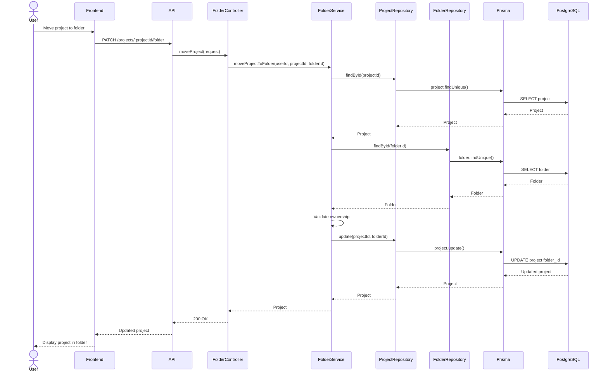

# Sequence Diagram - Move Project to Folder

```mermaid
sequenceDiagram

    actor User

    participant Frontend

    participant API

    participant FolderController

    participant FolderService

    participant ProjectRepository

    participant FolderRepository

    participant Prisma

    participant PostgreSQL

    User->>Frontend: Move project to folder

    Frontend->>API: PATCH /projects/:projectId/folder

    API->>FolderController: moveProject(request)

    FolderController->>FolderService: moveProjectToFolder(userId, projectId, folderId)

    FolderService->>ProjectRepository: findById(projectId)

    ProjectRepository->>Prisma: project.findUnique()

    Prisma->>PostgreSQL: SELECT project

    PostgreSQL-->>Prisma: Project

    Prisma-->>ProjectRepository: Project

    ProjectRepository-->>FolderService: Project

    FolderService->>FolderRepository: findById(folderId)

    FolderRepository->>Prisma: folder.findUnique()

    Prisma->>PostgreSQL: SELECT folder

    PostgreSQL-->>Prisma: Folder

    Prisma-->>FolderRepository: Folder

    FolderRepository-->>FolderService: Folder

    FolderService->>FolderService: Validate ownership

    FolderService->>ProjectRepository: update(projectId, folderId)

    ProjectRepository->>Prisma: project.update()

    Prisma->>PostgreSQL: UPDATE project folder_id

    PostgreSQL-->>Prisma: Updated project

    Prisma-->>ProjectRepository: Project

    ProjectRepository-->>FolderService: Project

    FolderService-->>FolderController: Project

    FolderController-->>API: 200 OK

    API-->>Frontend: Updated project

    Frontend-->>User: Display project in folder
```
