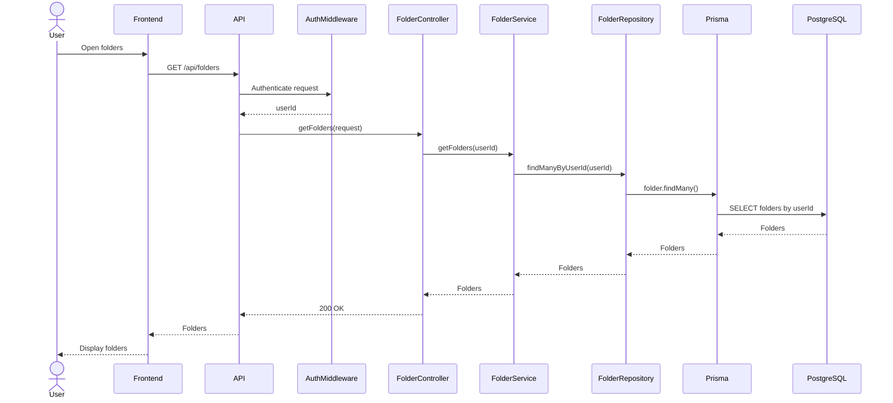
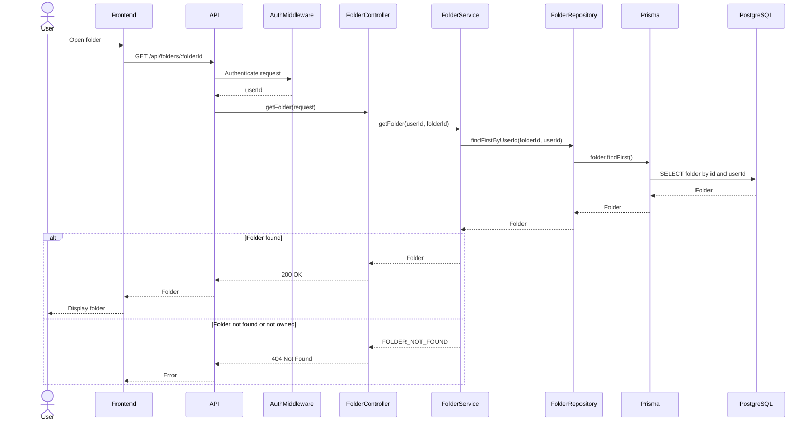

# Folder - Retrieval

## Get Folders

```mermaid
sequenceDiagram
    actor User
    participant Frontend
    participant API
    participant AuthMiddleware
    participant FolderController
    participant FolderService
    participant FolderRepository
    participant Prisma
    participant PostgreSQL

    User->>Frontend: Open folders
    Frontend->>API: GET /api/folders
    API->>AuthMiddleware: Authenticate request
    AuthMiddleware-->>API: userId
    API->>FolderController: getFolders(request)
    FolderController->>FolderService: getFolders(userId)
    FolderService->>FolderRepository: findManyByUserId(userId)
    FolderRepository->>Prisma: folder.findMany()
    Prisma->>PostgreSQL: SELECT folders by userId
    PostgreSQL-->>Prisma: Folders
    Prisma-->>FolderRepository: Folders
    FolderRepository-->>FolderService: Folders
    FolderService-->>FolderController: Folders
    FolderController-->>API: 200 OK
    API-->>Frontend: Folders
    Frontend-->>User: Display folders
```

## Get Folder

```mermaid
sequenceDiagram
    actor User
    participant Frontend
    participant API
    participant AuthMiddleware
    participant FolderController
    participant FolderService
    participant FolderRepository
    participant Prisma
    participant PostgreSQL

    User->>Frontend: Open folder
    Frontend->>API: GET /api/folders/:folderId
    API->>AuthMiddleware: Authenticate request
    AuthMiddleware-->>API: userId
    API->>FolderController: getFolder(request)
    FolderController->>FolderService: getFolder(userId, folderId)
    FolderService->>FolderRepository: findFirstByUserId(folderId, userId)
    FolderRepository->>Prisma: folder.findFirst()
    Prisma->>PostgreSQL: SELECT folder by id and userId
    PostgreSQL-->>Prisma: Folder
    Prisma-->>FolderRepository: Folder
    FolderRepository-->>FolderService: Folder

    alt Folder found
        FolderService-->>FolderController: Folder
        FolderController-->>API: 200 OK
        API-->>Frontend: Folder
        Frontend-->>User: Display folder
    else Folder not found or not owned
        FolderService-->>FolderController: FOLDER_NOT_FOUND
        FolderController-->>API: 404 Not Found
        API-->>Frontend: Error
    end
```
