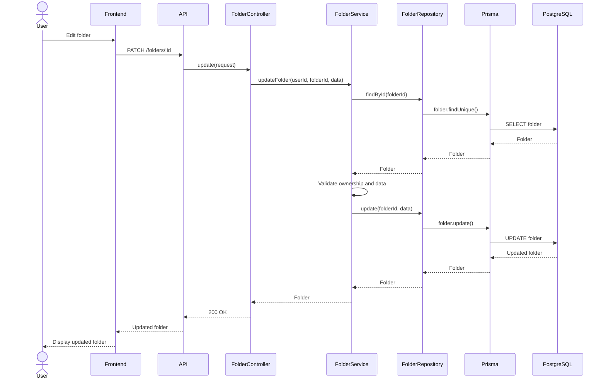

# Sequence Diagram - Folder - Update

```mermaid
sequenceDiagram

    actor User

    participant Frontend

    participant API

    participant FolderController

    participant FolderService

    participant FolderRepository

    participant Prisma

    participant PostgreSQL

    User->>Frontend: Edit folder

    Frontend->>API: PATCH /folders/:id

    API->>FolderController: update(request)

    FolderController->>FolderService: updateFolder(userId, folderId, data)

    FolderService->>FolderRepository: findById(folderId)

    FolderRepository->>Prisma: folder.findUnique()

    Prisma->>PostgreSQL: SELECT folder

    PostgreSQL-->>Prisma: Folder

    Prisma-->>FolderRepository: Folder

    FolderRepository-->>FolderService: Folder

    FolderService->>FolderService: Validate ownership and data

    FolderService->>FolderRepository: update(folderId, data)

    FolderRepository->>Prisma: folder.update()

    Prisma->>PostgreSQL: UPDATE folder

    PostgreSQL-->>Prisma: Updated folder

    Prisma-->>FolderRepository: Folder

    FolderRepository-->>FolderService: Folder

    FolderService-->>FolderController: Folder

    FolderController-->>API: 200 OK

    API-->>Frontend: Updated folder

    Frontend-->>User: Display updated folder
```
