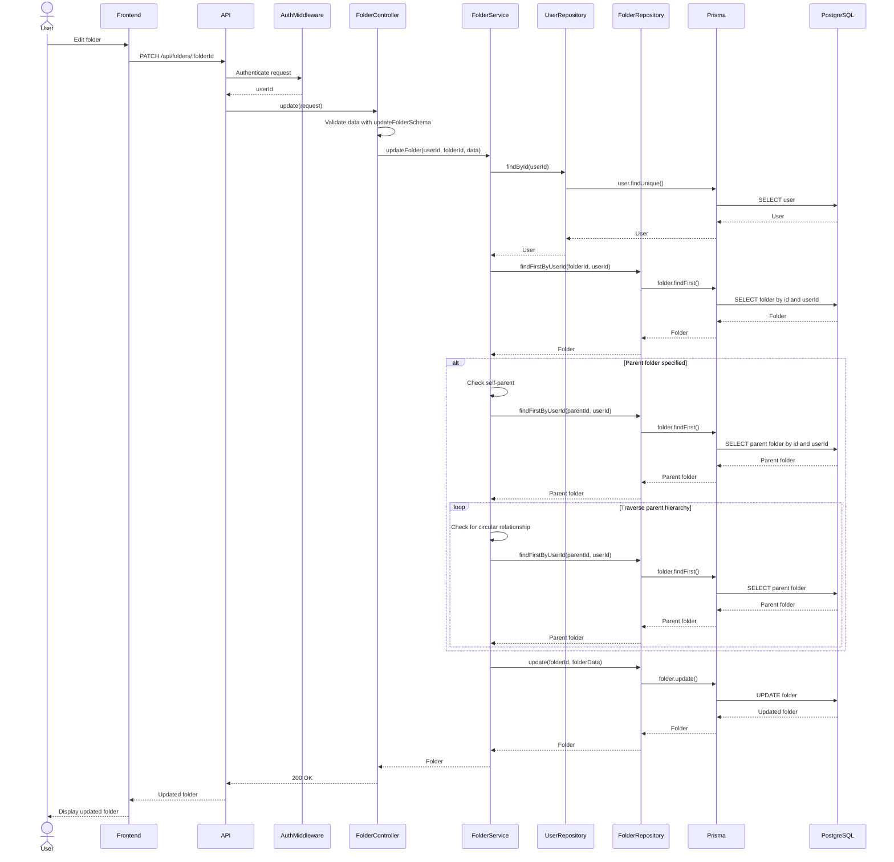

# Folder - Update

```mermaid
sequenceDiagram
    actor User
    participant Frontend
    participant API
    participant AuthMiddleware
    participant FolderController
    participant FolderService
    participant UserRepository
    participant FolderRepository
    participant Prisma
    participant PostgreSQL

    User->>Frontend: Edit folder
    Frontend->>API: PATCH /api/folders/:folderId
    API->>AuthMiddleware: Authenticate request
    AuthMiddleware-->>API: userId
    API->>FolderController: update(request)
    FolderController->>FolderController: Validate data with updateFolderSchema
    FolderController->>FolderService: updateFolder(userId, folderId, data)

    FolderService->>UserRepository: findById(userId)
    UserRepository->>Prisma: user.findUnique()
    Prisma->>PostgreSQL: SELECT user
    PostgreSQL-->>Prisma: User
    Prisma-->>UserRepository: User
    UserRepository-->>FolderService: User

    FolderService->>FolderRepository: findFirstByUserId(folderId, userId)
    FolderRepository->>Prisma: folder.findFirst()
    Prisma->>PostgreSQL: SELECT folder by id and userId
    PostgreSQL-->>Prisma: Folder
    Prisma-->>FolderRepository: Folder
    FolderRepository-->>FolderService: Folder

    alt Parent folder specified
        FolderService->>FolderService: Check self-parent
        FolderService->>FolderRepository: findFirstByUserId(parentId, userId)
        FolderRepository->>Prisma: folder.findFirst()
        Prisma->>PostgreSQL: SELECT parent folder by id and userId
        PostgreSQL-->>Prisma: Parent folder
        Prisma-->>FolderRepository: Parent folder
        FolderRepository-->>FolderService: Parent folder

        loop Traverse parent hierarchy
            FolderService->>FolderService: Check for circular relationship
            FolderService->>FolderRepository: findFirstByUserId(parentId, userId)
            FolderRepository->>Prisma: folder.findFirst()
            Prisma->>PostgreSQL: SELECT parent folder
            PostgreSQL-->>Prisma: Parent folder
            Prisma-->>FolderRepository: Parent folder
            FolderRepository-->>FolderService: Parent folder
        end
    end

    FolderService->>FolderRepository: update(folderId, folderData)
    FolderRepository->>Prisma: folder.update()
    Prisma->>PostgreSQL: UPDATE folder
    PostgreSQL-->>Prisma: Updated folder
    Prisma-->>FolderRepository: Folder
    FolderRepository-->>FolderService: Folder
    FolderService-->>FolderController: Folder
    FolderController-->>API: 200 OK
    API-->>Frontend: Updated folder
    Frontend-->>User: Display updated folder
```
