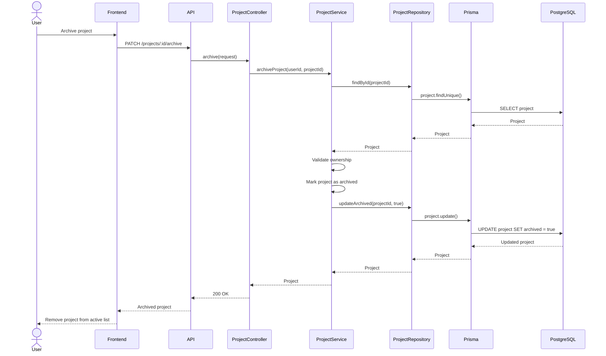

# Sequence Diagram - Archive Project

```mermaid
sequenceDiagram

    actor User

    participant Frontend

    participant API

    participant ProjectController

    participant ProjectService

    participant ProjectRepository

    participant Prisma

    participant PostgreSQL

    User->>Frontend: Archive project

    Frontend->>API: PATCH /projects/:id/archive

    API->>ProjectController: archive(request)

    ProjectController->>ProjectService: archiveProject(userId, projectId)

    ProjectService->>ProjectRepository: findById(projectId)

    ProjectRepository->>Prisma: project.findUnique()

    Prisma->>PostgreSQL: SELECT project

    PostgreSQL-->>Prisma: Project

    Prisma-->>ProjectRepository: Project

    ProjectRepository-->>ProjectService: Project

    ProjectService->>ProjectService: Validate ownership

    ProjectService->>ProjectService: Mark project as archived

    ProjectService->>ProjectRepository: updateArchived(projectId, true)

    ProjectRepository->>Prisma: project.update()

    Prisma->>PostgreSQL: UPDATE project SET archived = true

    PostgreSQL-->>Prisma: Updated project

    Prisma-->>ProjectRepository: Project

    ProjectRepository-->>ProjectService: Project

    ProjectService-->>ProjectController: Project

    ProjectController-->>API: 200 OK

    API-->>Frontend: Archived project

    Frontend-->>User: Remove project from active list
```
