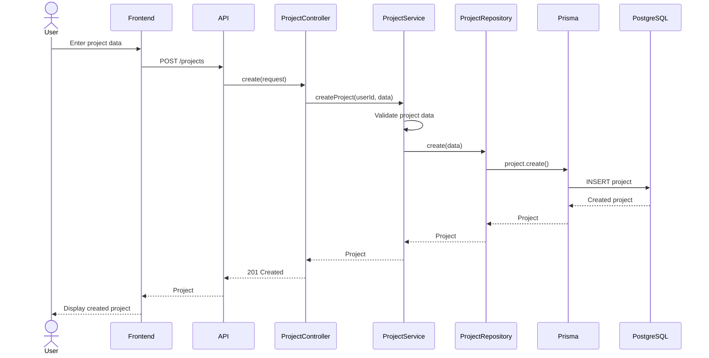

# Sequence Diagram - Project - Create

```mermaid
sequenceDiagram

    actor User

    participant Frontend

    participant API

    participant ProjectController

    participant ProjectService

    participant ProjectRepository

    participant Prisma

    participant PostgreSQL

    User->>Frontend: Enter project data

    Frontend->>API: POST /projects

    API->>ProjectController: create(request)

    ProjectController->>ProjectService: createProject(userId, data)

    ProjectService->>ProjectService: Validate project data

    ProjectService->>ProjectRepository: create(data)

    ProjectRepository->>Prisma: project.create()

    Prisma->>PostgreSQL: INSERT project

    PostgreSQL-->>Prisma: Created project

    Prisma-->>ProjectRepository: Project

    ProjectRepository-->>ProjectService: Project

    ProjectService-->>ProjectController: Project

    ProjectController-->>API: 201 Created

    API-->>Frontend: Project

    Frontend-->>User: Display created project
```
