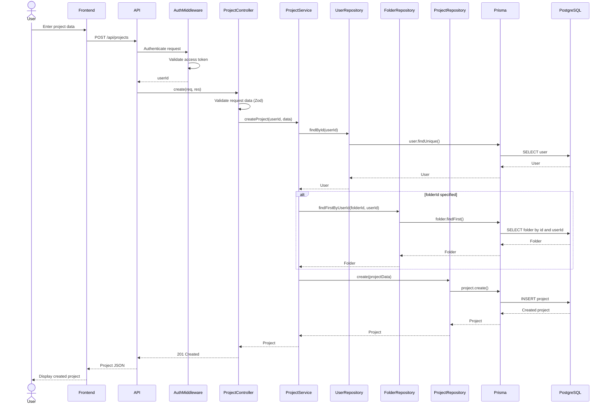

# Project - Create

```mermaid
sequenceDiagram
    actor User
    participant Frontend
    participant API
    participant AuthMiddleware
    participant ProjectController
    participant ProjectService
    participant UserRepository
    participant FolderRepository
    participant ProjectRepository
    participant Prisma
    participant PostgreSQL

    User->>Frontend: Enter project data
    Frontend->>API: POST /api/projects
    API->>AuthMiddleware: Authenticate request
    AuthMiddleware->>AuthMiddleware: Validate access token
    AuthMiddleware-->>API: userId
    API->>ProjectController: create(req, res)
    ProjectController->>ProjectController: Validate request data (Zod)
    ProjectController->>ProjectService: createProject(userId, data)

    ProjectService->>UserRepository: findById(userId)
    UserRepository->>Prisma: user.findUnique()
    Prisma->>PostgreSQL: SELECT user
    PostgreSQL-->>Prisma: User
    Prisma-->>UserRepository: User
    UserRepository-->>ProjectService: User

    alt folderId specified
        ProjectService->>FolderRepository: findFirstByUserId(folderId, userId)
        FolderRepository->>Prisma: folder.findFirst()
        Prisma->>PostgreSQL: SELECT folder by id and userId
        PostgreSQL-->>Prisma: Folder
        Prisma-->>FolderRepository: Folder
        FolderRepository-->>ProjectService: Folder
    end

    ProjectService->>ProjectRepository: create(projectData)
    ProjectRepository->>Prisma: project.create()
    Prisma->>PostgreSQL: INSERT project
    PostgreSQL-->>Prisma: Created project
    Prisma-->>ProjectRepository: Project
    ProjectRepository-->>ProjectService: Project
    ProjectService-->>ProjectController: Project
    ProjectController-->>API: 201 Created
    API-->>Frontend: Project JSON
    Frontend-->>User: Display created project
```
