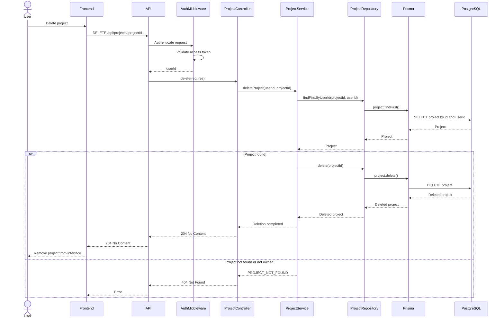

# Project - Delete

```mermaid
sequenceDiagram
    actor User
    participant Frontend
    participant API
    participant AuthMiddleware
    participant ProjectController
    participant ProjectService
    participant ProjectRepository
    participant Prisma
    participant PostgreSQL

    User->>Frontend: Delete project
    Frontend->>API: DELETE /api/projects/:projectId
    API->>AuthMiddleware: Authenticate request
    AuthMiddleware->>AuthMiddleware: Validate access token
    AuthMiddleware-->>API: userId
    API->>ProjectController: delete(req, res)
    ProjectController->>ProjectService: deleteProject(userId, projectId)

    ProjectService->>ProjectRepository: findFirstByUserId(projectId, userId)
    ProjectRepository->>Prisma: project.findFirst()
    Prisma->>PostgreSQL: SELECT project by id and userId
    PostgreSQL-->>Prisma: Project
    Prisma-->>ProjectRepository: Project
    ProjectRepository-->>ProjectService: Project

    alt Project found
        ProjectService->>ProjectRepository: delete(projectId)
        ProjectRepository->>Prisma: project.delete()
        Prisma->>PostgreSQL: DELETE project
        PostgreSQL-->>Prisma: Deleted project
        Prisma-->>ProjectRepository: Deleted project
        ProjectRepository-->>ProjectService: Deleted project
        ProjectService-->>ProjectController: Deletion completed
        ProjectController-->>API: 204 No Content
        API-->>Frontend: 204 No Content
        Frontend-->>User: Remove project from interface
    else Project not found or not owned
        ProjectService-->>ProjectController: PROJECT_NOT_FOUND
        ProjectController-->>API: 404 Not Found
        API-->>Frontend: Error
    end
```
