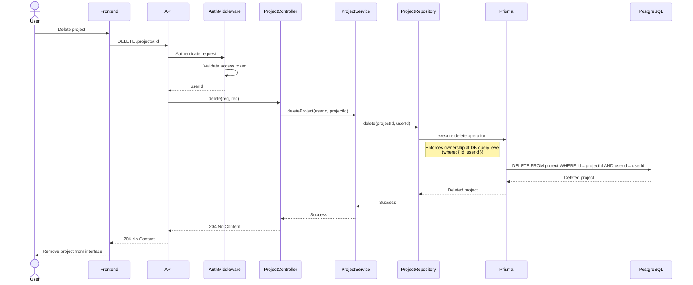

# Project - Delete

```mermaid
sequenceDiagram
    actor User

    participant Frontend
    participant API
    participant AuthMiddleware
    participant ProjectController
    participant ProjectService
    participant ProjectRepository
    participant Prisma
    participant PostgreSQL

    User->>Frontend: Delete project
    Frontend->>API: DELETE /projects/:id

    API->>AuthMiddleware: Authenticate request
    AuthMiddleware->>AuthMiddleware: Validate access token
    AuthMiddleware-->>API: userId

    API->>ProjectController: delete(req, res)
    ProjectController->>ProjectService: deleteProject(userId, projectId)
    ProjectService->>ProjectRepository: delete(projectId, userId)

    ProjectRepository->>Prisma: execute delete operation
    Note right of ProjectRepository: Enforces ownership at DB query level<br>(where: { id, userId })

    Prisma->>PostgreSQL: DELETE FROM project WHERE id = projectId AND userId = userId
    PostgreSQL-->>Prisma: Deleted project
    Prisma-->>ProjectRepository: Deleted project

    ProjectRepository-->>ProjectService: Success
    ProjectService-->>ProjectController: Success

    ProjectController-->>API: 204 No Content
    API-->>Frontend: 204 No Content
    Frontend-->>User: Remove project from interface
```
