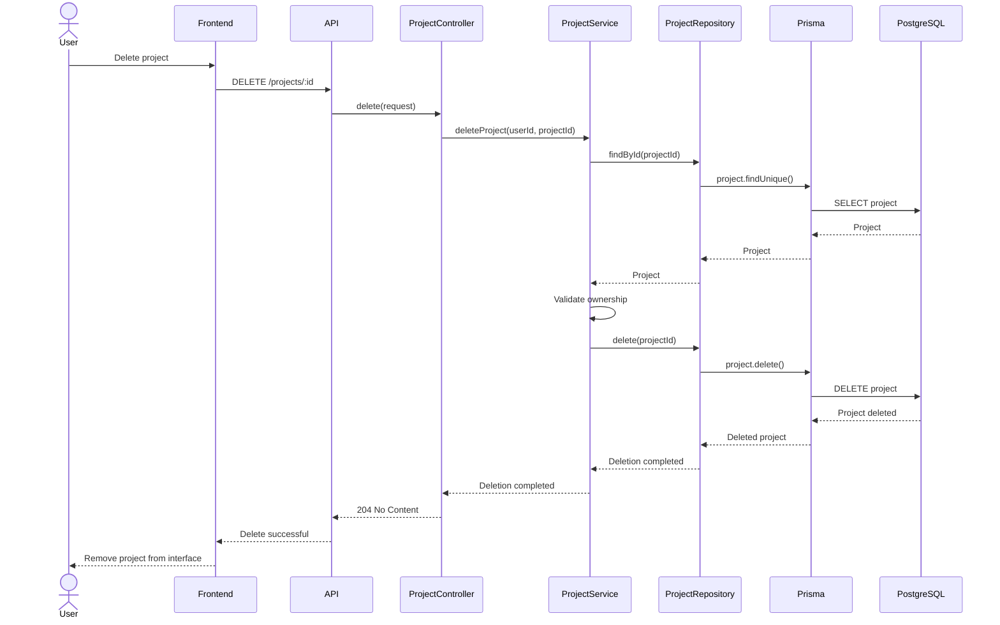

# Sequence Diagram - Project - Delete

```mermaid
sequenceDiagram

    actor User

    participant Frontend

    participant API

    participant ProjectController

    participant ProjectService

    participant ProjectRepository

    participant Prisma

    participant PostgreSQL

    User->>Frontend: Delete project

    Frontend->>API: DELETE /projects/:id

    API->>ProjectController: delete(request)

    ProjectController->>ProjectService: deleteProject(userId, projectId)

    ProjectService->>ProjectRepository: findById(projectId)

    ProjectRepository->>Prisma: project.findUnique()

    Prisma->>PostgreSQL: SELECT project

    PostgreSQL-->>Prisma: Project

    Prisma-->>ProjectRepository: Project

    ProjectRepository-->>ProjectService: Project

    ProjectService->>ProjectService: Validate ownership

    ProjectService->>ProjectRepository: delete(projectId)

    ProjectRepository->>Prisma: project.delete()

    Prisma->>PostgreSQL: DELETE project

    PostgreSQL-->>Prisma: Project deleted

    Prisma-->>ProjectRepository: Deleted project

    ProjectRepository-->>ProjectService: Deletion completed

    ProjectService-->>ProjectController: Deletion completed

    ProjectController-->>API: 204 No Content

    API-->>Frontend: Delete successful

    Frontend-->>User: Remove project from interface
```
