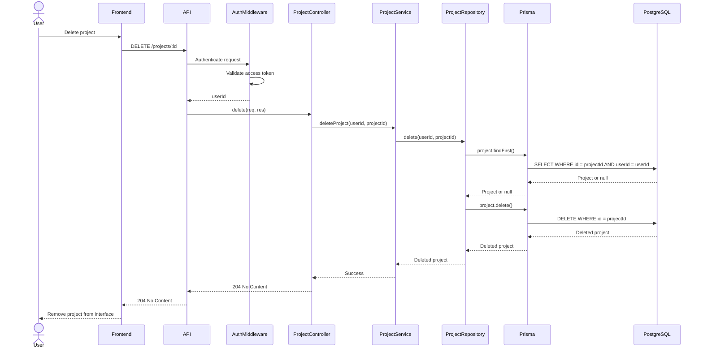

# Project - Delete

```mermaid
sequenceDiagram
    actor User
    participant Frontend
    participant API
    participant AuthMiddleware
    participant ProjectController
    participant ProjectService
    participant ProjectRepository
    participant Prisma
    participant PostgreSQL

    User->>Frontend: Delete project
    Frontend->>API: DELETE /projects/:id
    API->>AuthMiddleware: Authenticate request
    AuthMiddleware->>AuthMiddleware: Validate access token
    AuthMiddleware-->>API: userId

    API->>ProjectController: delete(req, res)
    ProjectController->>ProjectService: deleteProject(userId, projectId)
    ProjectService->>ProjectRepository: delete(userId, projectId)

    ProjectRepository->>Prisma: project.findFirst()
    Prisma->>PostgreSQL: SELECT WHERE id = projectId AND userId = userId
    PostgreSQL-->>Prisma: Project or null
    Prisma-->>ProjectRepository: Project or null

    ProjectRepository->>Prisma: project.delete()
    Prisma->>PostgreSQL: DELETE WHERE id = projectId
    PostgreSQL-->>Prisma: Deleted project
    Prisma-->>ProjectRepository: Deleted project

    ProjectRepository-->>ProjectService: Deleted project
    ProjectService-->>ProjectController: Success
    ProjectController-->>API: 204 No Content
    API-->>Frontend: 204 No Content
    Frontend-->>User: Remove project from interface

```
