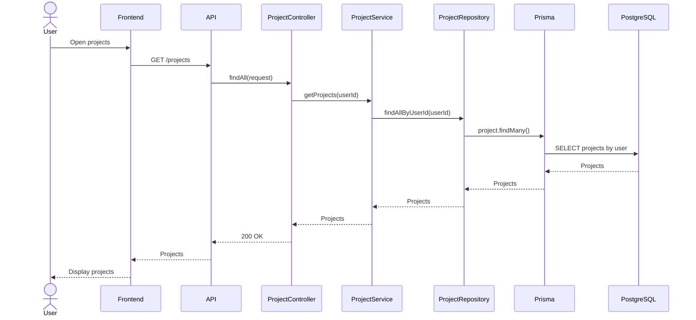
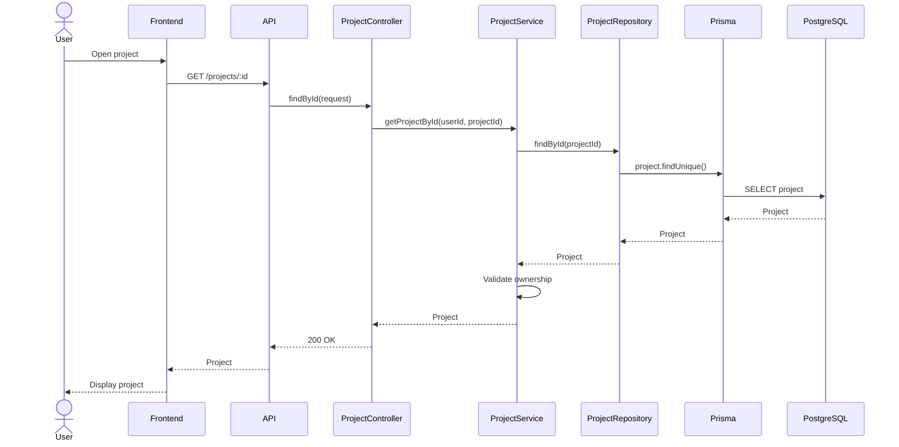

# Sequence Diagram - Project - Get

## Get Projects

```mermaid
sequenceDiagram

    actor User

    participant Frontend

    participant API

    participant ProjectController

    participant ProjectService

    participant ProjectRepository

    participant Prisma

    participant PostgreSQL

    User->>Frontend: Open projects

    Frontend->>API: GET /projects

    API->>ProjectController: findAll(request)

    ProjectController->>ProjectService: getProjects(userId)

    ProjectService->>ProjectRepository: findAllByUserId(userId)

    ProjectRepository->>Prisma: project.findMany()

    Prisma->>PostgreSQL: SELECT projects by user

    PostgreSQL-->>Prisma: Projects

    Prisma-->>ProjectRepository: Projects

    ProjectRepository-->>ProjectService: Projects

    ProjectService-->>ProjectController: Projects

    ProjectController-->>API: 200 OK

    API-->>Frontend: Projects

    Frontend-->>User: Display projects
```

## Get Project

```mermaid
sequenceDiagram

    actor User

    participant Frontend

    participant API

    participant ProjectController

    participant ProjectService

    participant ProjectRepository

    participant Prisma

    participant PostgreSQL

    User->>Frontend: Open project

    Frontend->>API: GET /projects/:id

    API->>ProjectController: findById(request)

    ProjectController->>ProjectService: getProjectById(userId, projectId)

    ProjectService->>ProjectRepository: findById(projectId)

    ProjectRepository->>Prisma: project.findUnique()

    Prisma->>PostgreSQL: SELECT project

    PostgreSQL-->>Prisma: Project

    Prisma-->>ProjectRepository: Project

    ProjectRepository-->>ProjectService: Project

    ProjectService->>ProjectService: Validate ownership

    ProjectService-->>ProjectController: Project

    ProjectController-->>API: 200 OK

    API-->>Frontend: Project

    Frontend-->>User: Display project
```
