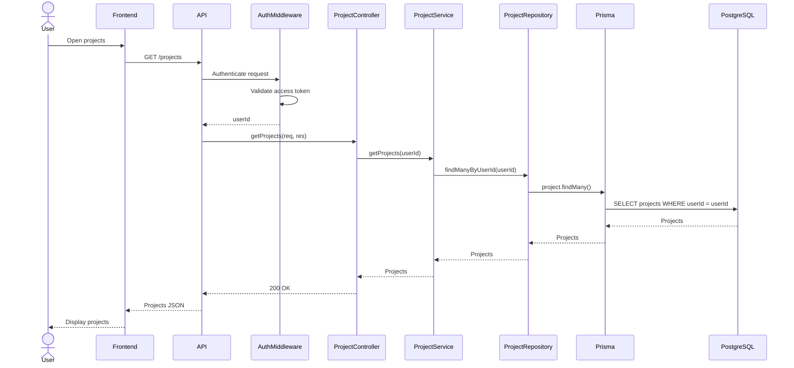
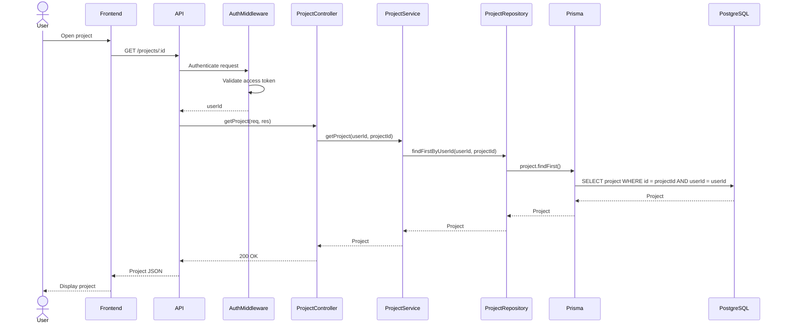

# Project - Get

## Get Projects

```mermaid
sequenceDiagram
    actor User
    participant Frontend
    participant API
    participant AuthMiddleware
    participant ProjectController
    participant ProjectService
    participant ProjectRepository
    participant Prisma
    participant PostgreSQL

    User->>Frontend: Open projects
    Frontend->>API: GET /projects
    API->>AuthMiddleware: Authenticate request
    AuthMiddleware->>AuthMiddleware: Validate access token
    AuthMiddleware-->>API: userId

    API->>ProjectController: getProjects(req, res)
    ProjectController->>ProjectService: getProjects(userId)
    ProjectService->>ProjectRepository: findManyByUserId(userId)
    ProjectRepository->>Prisma: project.findMany()
    Prisma->>PostgreSQL: SELECT projects WHERE userId = userId
    PostgreSQL-->>Prisma: Projects
    Prisma-->>ProjectRepository: Projects
    ProjectRepository-->>ProjectService: Projects
    ProjectService-->>ProjectController: Projects
    ProjectController-->>API: 200 OK
    API-->>Frontend: Projects JSON
    Frontend-->>User: Display projects
```

## Get Project

```mermaid
sequenceDiagram
    actor User
    participant Frontend
    participant API
    participant AuthMiddleware
    participant ProjectController
    participant ProjectService
    participant ProjectRepository
    participant Prisma
    participant PostgreSQL

    User->>Frontend: Open project
    Frontend->>API: GET /projects/:id
    API->>AuthMiddleware: Authenticate request
    AuthMiddleware->>AuthMiddleware: Validate access token
    AuthMiddleware-->>API: userId

    API->>ProjectController: getProject(req, res)
    ProjectController->>ProjectService: getProject(userId, projectId)
    ProjectService->>ProjectRepository: findFirstByUserId(userId, projectId)
    ProjectRepository->>Prisma: project.findFirst()
    Prisma->>PostgreSQL: SELECT project WHERE id = projectId AND userId = userId
    PostgreSQL-->>Prisma: Project
    Prisma-->>ProjectRepository: Project
    ProjectRepository-->>ProjectService: Project
    ProjectService-->>ProjectController: Project
    ProjectController-->>API: 200 OK
    API-->>Frontend: Project JSON
    Frontend-->>User: Display project
```
