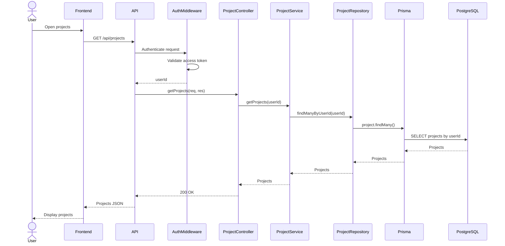
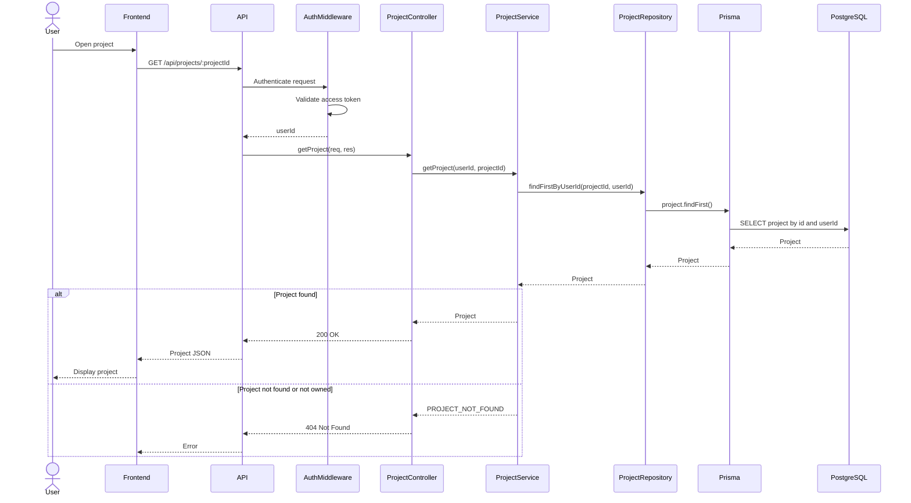

# Project - Retrieval

## Get Projects

```mermaid
sequenceDiagram
    actor User
    participant Frontend
    participant API
    participant AuthMiddleware
    participant ProjectController
    participant ProjectService
    participant ProjectRepository
    participant Prisma
    participant PostgreSQL

    User->>Frontend: Open projects
    Frontend->>API: GET /api/projects
    API->>AuthMiddleware: Authenticate request
    AuthMiddleware->>AuthMiddleware: Validate access token
    AuthMiddleware-->>API: userId
    API->>ProjectController: getProjects(req, res)
    ProjectController->>ProjectService: getProjects(userId)
    ProjectService->>ProjectRepository: findManyByUserId(userId)
    ProjectRepository->>Prisma: project.findMany()
    Prisma->>PostgreSQL: SELECT projects by userId
    PostgreSQL-->>Prisma: Projects
    Prisma-->>ProjectRepository: Projects
    ProjectRepository-->>ProjectService: Projects
    ProjectService-->>ProjectController: Projects
    ProjectController-->>API: 200 OK
    API-->>Frontend: Projects JSON
    Frontend-->>User: Display projects
```

## Get Project

```mermaid
sequenceDiagram
    actor User
    participant Frontend
    participant API
    participant AuthMiddleware
    participant ProjectController
    participant ProjectService
    participant ProjectRepository
    participant Prisma
    participant PostgreSQL

    User->>Frontend: Open project
    Frontend->>API: GET /api/projects/:projectId
    API->>AuthMiddleware: Authenticate request
    AuthMiddleware->>AuthMiddleware: Validate access token
    AuthMiddleware-->>API: userId
    API->>ProjectController: getProject(req, res)
    ProjectController->>ProjectService: getProject(userId, projectId)
    ProjectService->>ProjectRepository: findFirstByUserId(projectId, userId)
    ProjectRepository->>Prisma: project.findFirst()
    Prisma->>PostgreSQL: SELECT project by id and userId
    PostgreSQL-->>Prisma: Project
    Prisma-->>ProjectRepository: Project
    ProjectRepository-->>ProjectService: Project

    alt Project found
        ProjectService-->>ProjectController: Project
        ProjectController-->>API: 200 OK
        API-->>Frontend: Project JSON
        Frontend-->>User: Display project
    else Project not found or not owned
        ProjectService-->>ProjectController: PROJECT_NOT_FOUND
        ProjectController-->>API: 404 Not Found
        API-->>Frontend: Error
    end
```
