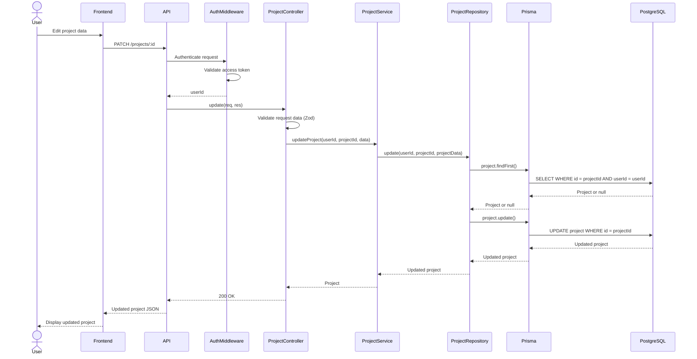

# Project - Update

```mermaid
sequenceDiagram
    actor User
    participant Frontend
    participant API
    participant AuthMiddleware
    participant ProjectController
    participant ProjectService
    participant ProjectRepository
    participant Prisma
    participant PostgreSQL

    User->>Frontend: Edit project data
    Frontend->>API: PATCH /projects/:id
    API->>AuthMiddleware: Authenticate request
    AuthMiddleware->>AuthMiddleware: Validate access token
    AuthMiddleware-->>API: userId

    API->>ProjectController: update(req, res)
    ProjectController->>ProjectController: Validate request data (Zod)
    ProjectController->>ProjectService: updateProject(userId, projectId, data)
    ProjectService->>ProjectRepository: update(userId, projectId, projectData)

    ProjectRepository->>Prisma: project.findFirst()
    Prisma->>PostgreSQL: SELECT WHERE id = projectId AND userId = userId
    PostgreSQL-->>Prisma: Project or null
    Prisma-->>ProjectRepository: Project or null

    ProjectRepository->>Prisma: project.update()
    Prisma->>PostgreSQL: UPDATE project WHERE id = projectId
    PostgreSQL-->>Prisma: Updated project
    Prisma-->>ProjectRepository: Updated project

    ProjectRepository-->>ProjectService: Updated project
    ProjectService-->>ProjectController: Project
    ProjectController-->>API: 200 OK
    API-->>Frontend: Updated project JSON
    Frontend-->>User: Display updated project
```
