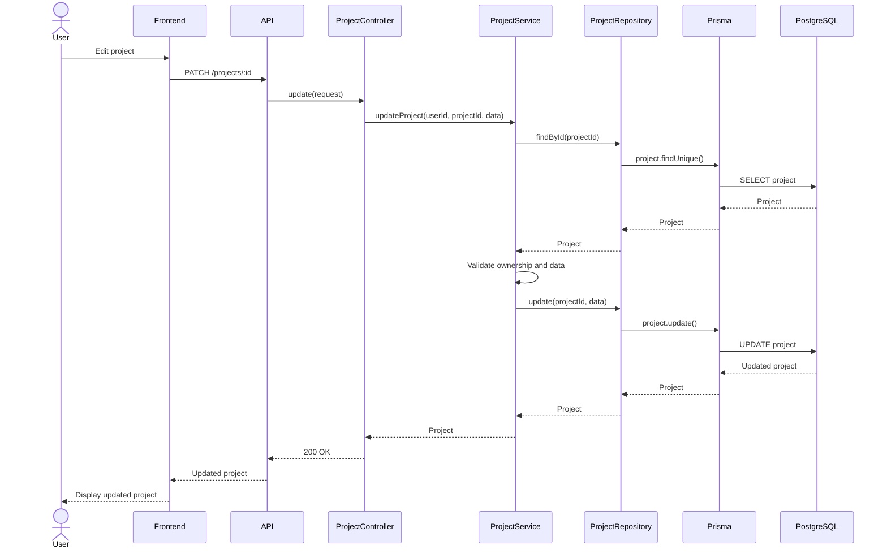

# Sequence Diagram - Project - Update

```mermaid
sequenceDiagram

    actor User

    participant Frontend

    participant API

    participant ProjectController

    participant ProjectService

    participant ProjectRepository

    participant Prisma

    participant PostgreSQL

    User->>Frontend: Edit project

    Frontend->>API: PATCH /projects/:id

    API->>ProjectController: update(request)

    ProjectController->>ProjectService: updateProject(userId, projectId, data)

    ProjectService->>ProjectRepository: findById(projectId)

    ProjectRepository->>Prisma: project.findUnique()

    Prisma->>PostgreSQL: SELECT project

    PostgreSQL-->>Prisma: Project

    Prisma-->>ProjectRepository: Project

    ProjectRepository-->>ProjectService: Project

    ProjectService->>ProjectService: Validate ownership and data

    ProjectService->>ProjectRepository: update(projectId, data)

    ProjectRepository->>Prisma: project.update()

    Prisma->>PostgreSQL: UPDATE project

    PostgreSQL-->>Prisma: Updated project

    Prisma-->>ProjectRepository: Project

    ProjectRepository-->>ProjectService: Project

    ProjectService-->>ProjectController: Project

    ProjectController-->>API: 200 OK

    API-->>Frontend: Updated project

    Frontend-->>User: Display updated project
```
