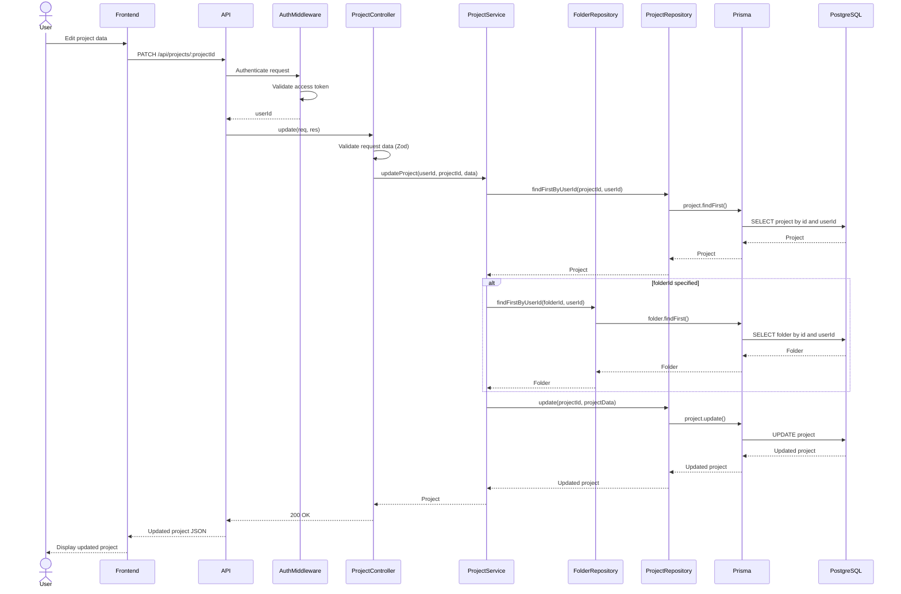

# Project - Update

```mermaid
sequenceDiagram
    actor User
    participant Frontend
    participant API
    participant AuthMiddleware
    participant ProjectController
    participant ProjectService
    participant FolderRepository
    participant ProjectRepository
    participant Prisma
    participant PostgreSQL

    User->>Frontend: Edit project data
    Frontend->>API: PATCH /api/projects/:projectId
    API->>AuthMiddleware: Authenticate request
    AuthMiddleware->>AuthMiddleware: Validate access token
    AuthMiddleware-->>API: userId
    API->>ProjectController: update(req, res)
    ProjectController->>ProjectController: Validate request data (Zod)
    ProjectController->>ProjectService: updateProject(userId, projectId, data)

    ProjectService->>ProjectRepository: findFirstByUserId(projectId, userId)
    ProjectRepository->>Prisma: project.findFirst()
    Prisma->>PostgreSQL: SELECT project by id and userId
    PostgreSQL-->>Prisma: Project
    Prisma-->>ProjectRepository: Project
    ProjectRepository-->>ProjectService: Project

    alt folderId specified
        ProjectService->>FolderRepository: findFirstByUserId(folderId, userId)
        FolderRepository->>Prisma: folder.findFirst()
        Prisma->>PostgreSQL: SELECT folder by id and userId
        PostgreSQL-->>Prisma: Folder
        Prisma-->>FolderRepository: Folder
        FolderRepository-->>ProjectService: Folder
    end

    ProjectService->>ProjectRepository: update(projectId, projectData)
    ProjectRepository->>Prisma: project.update()
    Prisma->>PostgreSQL: UPDATE project
    PostgreSQL-->>Prisma: Updated project
    Prisma-->>ProjectRepository: Updated project
    ProjectRepository-->>ProjectService: Updated project
    ProjectService-->>ProjectController: Project
    ProjectController-->>API: 200 OK
    API-->>Frontend: Updated project JSON
    Frontend-->>User: Display updated project
```
