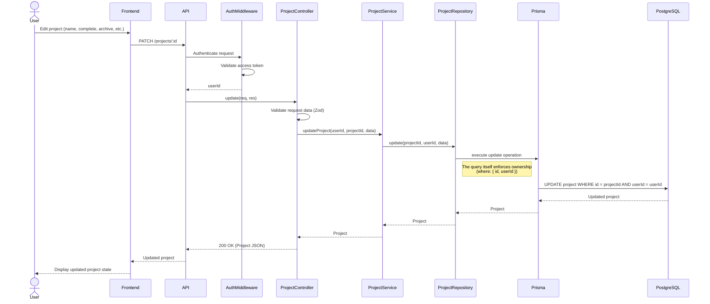

# Projects - Update

```mermaid
sequenceDiagram
    actor User

    participant Frontend
    participant API
    participant AuthMiddleware
    participant ProjectController
    participant ProjectService
    participant ProjectRepository
    participant Prisma
    participant PostgreSQL

    User->>Frontend: Edit project (name, complete, archive, etc.)
    Frontend->>API: PATCH /projects/:id

    API->>AuthMiddleware: Authenticate request
    AuthMiddleware->>AuthMiddleware: Validate access token
    AuthMiddleware-->>API: userId

    API->>ProjectController: update(req, res)
    ProjectController->>ProjectController: Validate request data (Zod)

    ProjectController->>ProjectService: updateProject(userId, projectId, data)
    ProjectService->>ProjectRepository: update(projectId, userId, data)

    ProjectRepository->>Prisma: execute update operation
    Note right of ProjectRepository: The query itself enforces ownership<br>(where: { id, userId })

    Prisma->>PostgreSQL: UPDATE project WHERE id = projectId AND userId = userId
    PostgreSQL-->>Prisma: Updated project
    Prisma-->>ProjectRepository: Project

    ProjectRepository-->>ProjectService: Project
    ProjectService-->>ProjectController: Project

    ProjectController-->>API: 200 OK (Project JSON)
    API-->>Frontend: Updated project
    Frontend-->>User: Display updated project state
```
