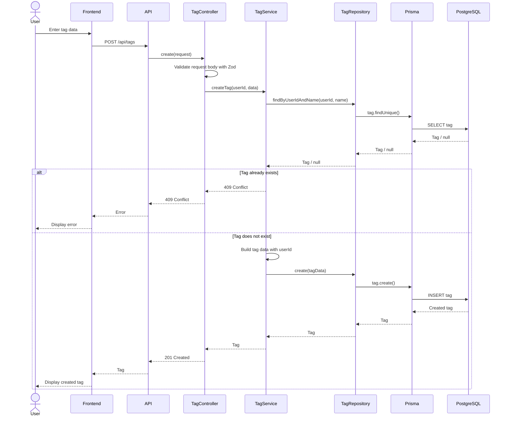

# Tag - Create

```mermaid
sequenceDiagram

    actor User
    participant Frontend
    participant API
    participant TagController
    participant TagService
    participant TagRepository
    participant Prisma
    participant PostgreSQL

    User->>Frontend: Enter tag data

    Frontend->>API: POST /api/tags
    API->>TagController: create(request)

    TagController->>TagController: Validate request body with Zod

    TagController->>TagService: createTag(userId, data)

    TagService->>TagRepository: findByUserIdAndName(userId, name)
    TagRepository->>Prisma: tag.findUnique()
    Prisma->>PostgreSQL: SELECT tag
    PostgreSQL-->>Prisma: Tag / null
    Prisma-->>TagRepository: Tag / null
    TagRepository-->>TagService: Tag / null

    alt Tag already exists
        TagService-->>TagController: 409 Conflict
        TagController-->>API: 409 Conflict
        API-->>Frontend: Error
        Frontend-->>User: Display error
    else Tag does not exist
        TagService->>TagService: Build tag data with userId

        TagService->>TagRepository: create(tagData)
        TagRepository->>Prisma: tag.create()
        Prisma->>PostgreSQL: INSERT tag
        PostgreSQL-->>Prisma: Created tag
        Prisma-->>TagRepository: Tag
        TagRepository-->>TagService: Tag

        TagService-->>TagController: Tag
        TagController-->>API: 201 Created
        API-->>Frontend: Tag
        Frontend-->>User: Display created tag
    end
```
