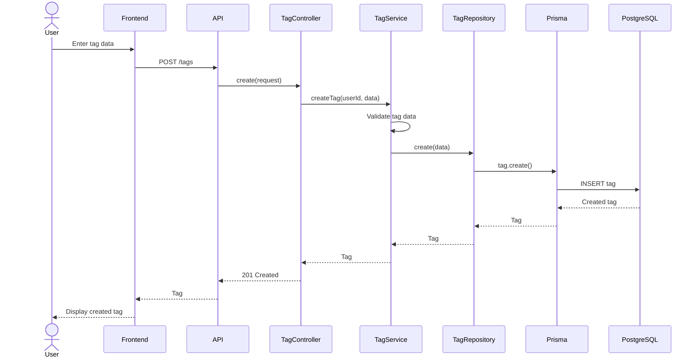

# Sequence Diagram - Tag - Create

```mermaid
sequenceDiagram

    actor User

    participant Frontend

    participant API

    participant TagController

    participant TagService

    participant TagRepository

    participant Prisma

    participant PostgreSQL

    User->>Frontend: Enter tag data

    Frontend->>API: POST /tags

    API->>TagController: create(request)

    TagController->>TagService: createTag(userId, data)

    TagService->>TagService: Validate tag data

    TagService->>TagRepository: create(data)

    TagRepository->>Prisma: tag.create()

    Prisma->>PostgreSQL: INSERT tag

    PostgreSQL-->>Prisma: Created tag

    Prisma-->>TagRepository: Tag

    TagRepository-->>TagService: Tag

    TagService-->>TagController: Tag

    TagController-->>API: 201 Created

    API-->>Frontend: Tag

    Frontend-->>User: Display created tag
```
