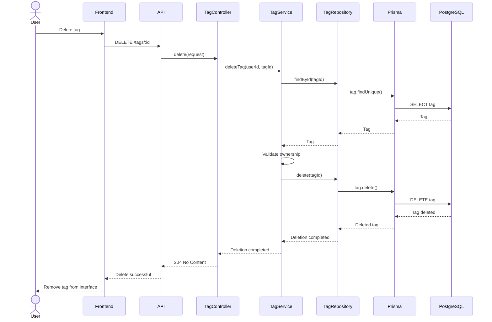

# Sequence Diagram - Tag - Delete

```mermaid
sequenceDiagram

    actor User

    participant Frontend

    participant API

    participant TagController

    participant TagService

    participant TagRepository

    participant Prisma

    participant PostgreSQL

    User->>Frontend: Delete tag

    Frontend->>API: DELETE /tags/:id

    API->>TagController: delete(request)

    TagController->>TagService: deleteTag(userId, tagId)

    TagService->>TagRepository: findById(tagId)

    TagRepository->>Prisma: tag.findUnique()

    Prisma->>PostgreSQL: SELECT tag

    PostgreSQL-->>Prisma: Tag

    Prisma-->>TagRepository: Tag

    TagRepository-->>TagService: Tag

    TagService->>TagService: Validate ownership

    TagService->>TagRepository: delete(tagId)

    TagRepository->>Prisma: tag.delete()

    Prisma->>PostgreSQL: DELETE tag

    PostgreSQL-->>Prisma: Tag deleted

    Prisma-->>TagRepository: Deleted tag

    TagRepository-->>TagService: Deletion completed

    TagService-->>TagController: Deletion completed

    TagController-->>API: 204 No Content

    API-->>Frontend: Delete successful

    Frontend-->>User: Remove tag from interface
```
