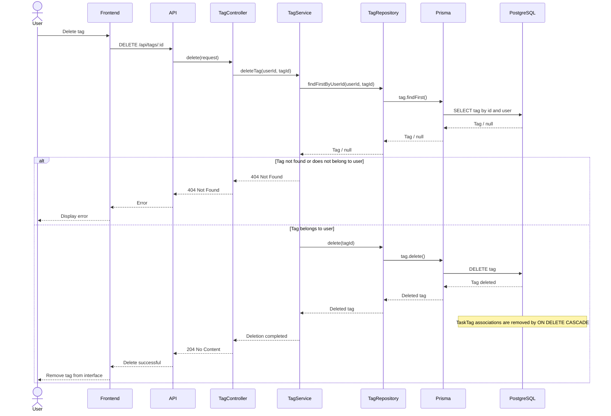

# Tag - Delete

```mermaid
sequenceDiagram

    actor User
    participant Frontend
    participant API
    participant TagController
    participant TagService
    participant TagRepository
    participant Prisma
    participant PostgreSQL

    User->>Frontend: Delete tag

    Frontend->>API: DELETE /api/tags/:id
    API->>TagController: delete(request)

    TagController->>TagService: deleteTag(userId, tagId)

    TagService->>TagRepository: findFirstByUserId(userId, tagId)
    TagRepository->>Prisma: tag.findFirst()
    Prisma->>PostgreSQL: SELECT tag by id and user
    PostgreSQL-->>Prisma: Tag / null
    Prisma-->>TagRepository: Tag / null
    TagRepository-->>TagService: Tag / null

    alt Tag not found or does not belong to user
        TagService-->>TagController: 404 Not Found
        TagController-->>API: 404 Not Found
        API-->>Frontend: Error
        Frontend-->>User: Display error
    else Tag belongs to user

        TagService->>TagRepository: delete(tagId)
        TagRepository->>Prisma: tag.delete()
        Prisma->>PostgreSQL: DELETE tag

        PostgreSQL-->>Prisma: Tag deleted
        Prisma-->>TagRepository: Deleted tag
        TagRepository-->>TagService: Deleted tag

        Note over PostgreSQL: TaskTag associations are removed by ON DELETE CASCADE

        TagService-->>TagController: Deletion completed
        TagController-->>API: 204 No Content
        API-->>Frontend: Delete successful
        Frontend-->>User: Remove tag from interface
    end
```
