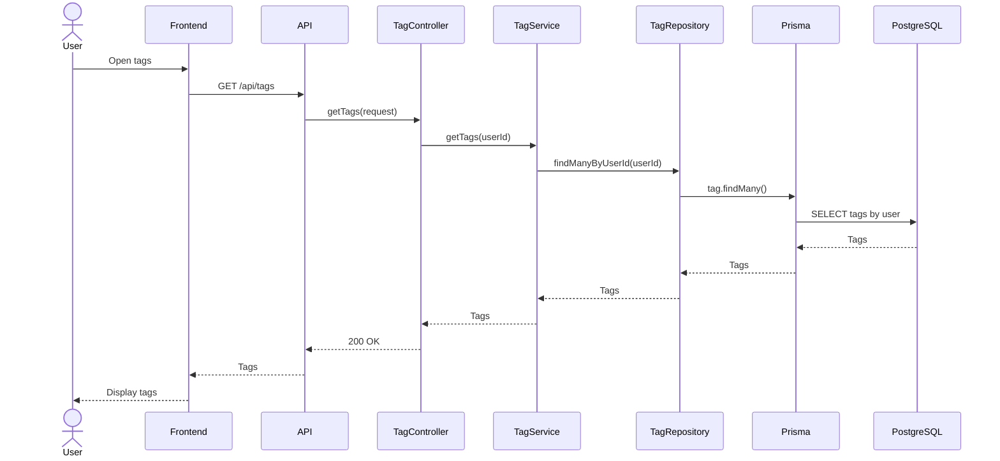
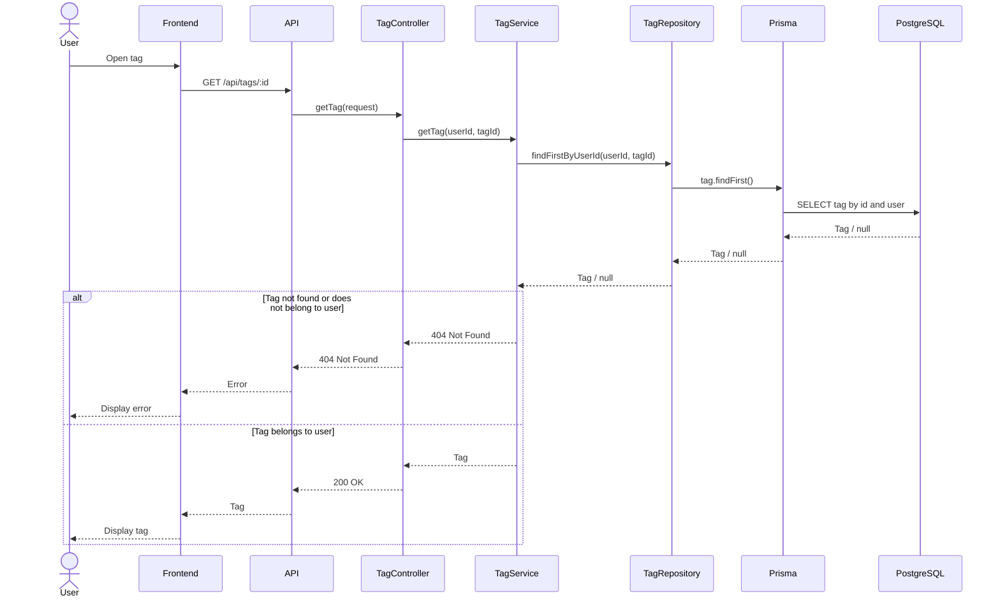

# Tag - Get

## Get Tags

```mermaid id="4r8k2m"
sequenceDiagram

    actor User
    participant Frontend
    participant API
    participant TagController
    participant TagService
    participant TagRepository
    participant Prisma
    participant PostgreSQL

    User->>Frontend: Open tags

    Frontend->>API: GET /api/tags
    API->>TagController: getTags(request)

    TagController->>TagService: getTags(userId)

    TagService->>TagRepository: findManyByUserId(userId)
    TagRepository->>Prisma: tag.findMany()
    Prisma->>PostgreSQL: SELECT tags by user
    PostgreSQL-->>Prisma: Tags
    Prisma-->>TagRepository: Tags
    TagRepository-->>TagService: Tags

    TagService-->>TagController: Tags
    TagController-->>API: 200 OK
    API-->>Frontend: Tags
    Frontend-->>User: Display tags
```

## Get Tag

```mermaid
sequenceDiagram

    actor User
    participant Frontend
    participant API
    participant TagController
    participant TagService
    participant TagRepository
    participant Prisma
    participant PostgreSQL

    User->>Frontend: Open tag

    Frontend->>API: GET /api/tags/:id
    API->>TagController: getTag(request)

    TagController->>TagService: getTag(userId, tagId)

    TagService->>TagRepository: findFirstByUserId(userId, tagId)
    TagRepository->>Prisma: tag.findFirst()
    Prisma->>PostgreSQL: SELECT tag by id and user
    PostgreSQL-->>Prisma: Tag / null
    Prisma-->>TagRepository: Tag / null
    TagRepository-->>TagService: Tag / null

    alt Tag not found or does not belong to user
        TagService-->>TagController: 404 Not Found
        TagController-->>API: 404 Not Found
        API-->>Frontend: Error
        Frontend-->>User: Display error
    else Tag belongs to user
        TagService-->>TagController: Tag
        TagController-->>API: 200 OK
        API-->>Frontend: Tag
        Frontend-->>User: Display tag
    end
```
