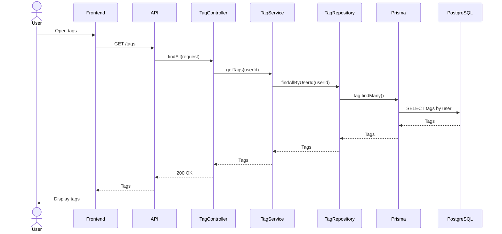
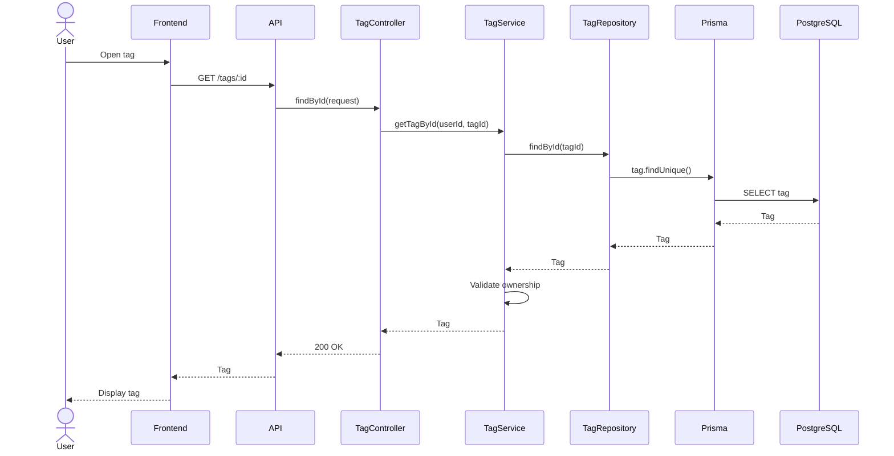

# Sequence Diagram - Tag - Get

## Get Tags

```mermaid
sequenceDiagram

    actor User

    participant Frontend

    participant API

    participant TagController

    participant TagService

    participant TagRepository

    participant Prisma

    participant PostgreSQL

    User->>Frontend: Open tags

    Frontend->>API: GET /tags

    API->>TagController: findAll(request)

    TagController->>TagService: getTags(userId)

    TagService->>TagRepository: findAllByUserId(userId)

    TagRepository->>Prisma: tag.findMany()

    Prisma->>PostgreSQL: SELECT tags by user

    PostgreSQL-->>Prisma: Tags

    Prisma-->>TagRepository: Tags

    TagRepository-->>TagService: Tags

    TagService-->>TagController: Tags

    TagController-->>API: 200 OK

    API-->>Frontend: Tags

    Frontend-->>User: Display tags
```

## Get Tag

```mermaid
sequenceDiagram

    actor User

    participant Frontend

    participant API

    participant TagController

    participant TagService

    participant TagRepository

    participant Prisma

    participant PostgreSQL

    User->>Frontend: Open tag

    Frontend->>API: GET /tags/:id

    API->>TagController: findById(request)

    TagController->>TagService: getTagById(userId, tagId)

    TagService->>TagRepository: findById(tagId)

    TagRepository->>Prisma: tag.findUnique()

    Prisma->>PostgreSQL: SELECT tag

    PostgreSQL-->>Prisma: Tag

    Prisma-->>TagRepository: Tag

    TagRepository-->>TagService: Tag

    TagService->>TagService: Validate ownership

    TagService-->>TagController: Tag

    TagController-->>API: 200 OK

    API-->>Frontend: Tag

    Frontend-->>User: Display tag
```
