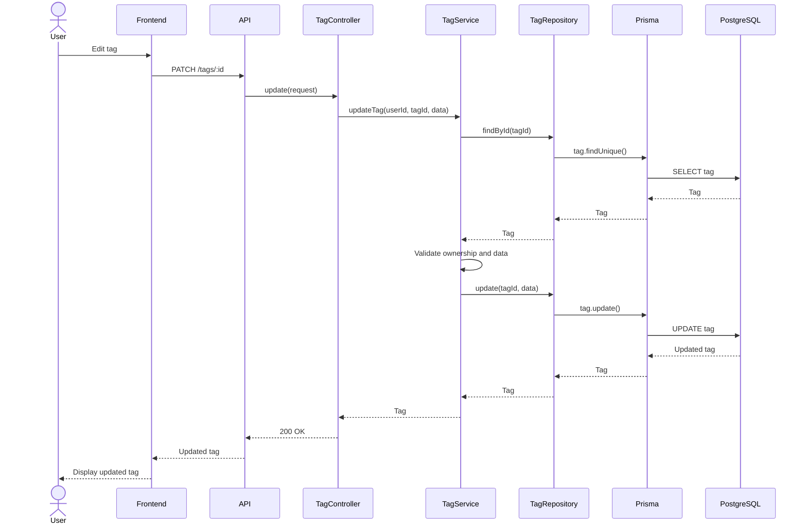

# Sequence Diagram - Tag - Update

```mermaid
sequenceDiagram

    actor User

    participant Frontend

    participant API

    participant TagController

    participant TagService

    participant TagRepository

    participant Prisma

    participant PostgreSQL

    User->>Frontend: Edit tag

    Frontend->>API: PATCH /tags/:id

    API->>TagController: update(request)

    TagController->>TagService: updateTag(userId, tagId, data)

    TagService->>TagRepository: findById(tagId)

    TagRepository->>Prisma: tag.findUnique()

    Prisma->>PostgreSQL: SELECT tag

    PostgreSQL-->>Prisma: Tag

    Prisma-->>TagRepository: Tag

    TagRepository-->>TagService: Tag

    TagService->>TagService: Validate ownership and data

    TagService->>TagRepository: update(tagId, data)

    TagRepository->>Prisma: tag.update()

    Prisma->>PostgreSQL: UPDATE tag

    PostgreSQL-->>Prisma: Updated tag

    Prisma-->>TagRepository: Tag

    TagRepository-->>TagService: Tag

    TagService-->>TagController: Tag

    TagController-->>API: 200 OK

    API-->>Frontend: Updated tag

    Frontend-->>User: Display updated tag
```
