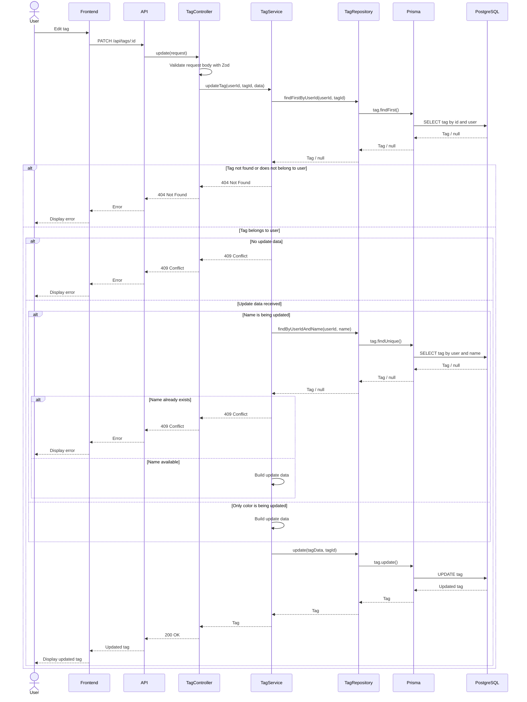

# Tag - Update

```mermaid
sequenceDiagram

    actor User
    participant Frontend
    participant API
    participant TagController
    participant TagService
    participant TagRepository
    participant Prisma
    participant PostgreSQL

    User->>Frontend: Edit tag

    Frontend->>API: PATCH /api/tags/:id
    API->>TagController: update(request)

    TagController->>TagController: Validate request body with Zod

    TagController->>TagService: updateTag(userId, tagId, data)

    TagService->>TagRepository: findFirstByUserId(userId, tagId)
    TagRepository->>Prisma: tag.findFirst()
    Prisma->>PostgreSQL: SELECT tag by id and user
    PostgreSQL-->>Prisma: Tag / null
    Prisma-->>TagRepository: Tag / null
    TagRepository-->>TagService: Tag / null

    alt Tag not found or does not belong to user
        TagService-->>TagController: 404 Not Found
        TagController-->>API: 404 Not Found
        API-->>Frontend: Error
        Frontend-->>User: Display error
    else Tag belongs to user

        alt No update data
            TagService-->>TagController: 409 Conflict
            TagController-->>API: 409 Conflict
            API-->>Frontend: Error
            Frontend-->>User: Display error
        else Update data received

            alt Name is being updated
                TagService->>TagRepository: findByUserIdAndName(userId, name)
                TagRepository->>Prisma: tag.findUnique()
                Prisma->>PostgreSQL: SELECT tag by user and name
                PostgreSQL-->>Prisma: Tag / null
                Prisma-->>TagRepository: Tag / null
                TagRepository-->>TagService: Tag / null

                alt Name already exists
                    TagService-->>TagController: 409 Conflict
                    TagController-->>API: 409 Conflict
                    API-->>Frontend: Error
                    Frontend-->>User: Display error
                else Name available
                    TagService->>TagService: Build update data
                end
            else Only color is being updated
                TagService->>TagService: Build update data
            end

            TagService->>TagRepository: update(tagData, tagId)
            TagRepository->>Prisma: tag.update()
            Prisma->>PostgreSQL: UPDATE tag
            PostgreSQL-->>Prisma: Updated tag
            Prisma-->>TagRepository: Tag
            TagRepository-->>TagService: Tag

            TagService-->>TagController: Tag
            TagController-->>API: 200 OK
            API-->>Frontend: Updated tag
            Frontend-->>User: Display updated tag
        end
    end
```
