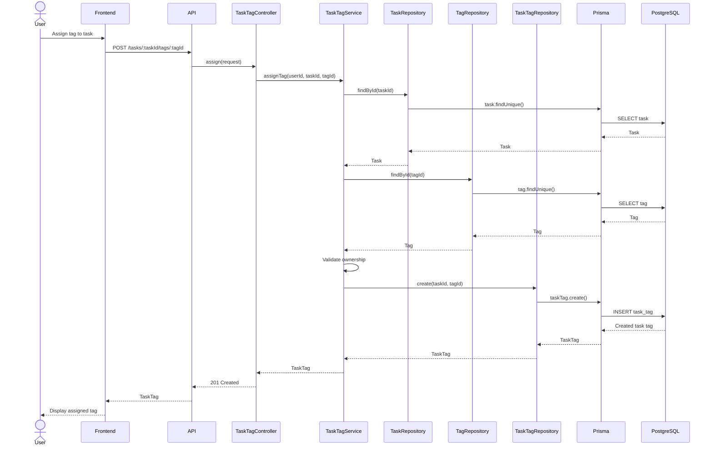

# Sequence Diagram - Assign Tag to Task

```mermaid
sequenceDiagram

    actor User

    participant Frontend

    participant API

    participant TaskTagController

    participant TaskTagService

    participant TaskRepository

    participant TagRepository

    participant TaskTagRepository

    participant Prisma

    participant PostgreSQL

    User->>Frontend: Assign tag to task

    Frontend->>API: POST /tasks/:taskId/tags/:tagId

    API->>TaskTagController: assign(request)

    TaskTagController->>TaskTagService: assignTag(userId, taskId, tagId)

    TaskTagService->>TaskRepository: findById(taskId)

    TaskRepository->>Prisma: task.findUnique()

    Prisma->>PostgreSQL: SELECT task

    PostgreSQL-->>Prisma: Task

    Prisma-->>TaskRepository: Task

    TaskRepository-->>TaskTagService: Task

    TaskTagService->>TagRepository: findById(tagId)

    TagRepository->>Prisma: tag.findUnique()

    Prisma->>PostgreSQL: SELECT tag

    PostgreSQL-->>Prisma: Tag

    Prisma-->>TagRepository: Tag

    TagRepository-->>TaskTagService: Tag

    TaskTagService->>TaskTagService: Validate ownership

    TaskTagService->>TaskTagRepository: create(taskId, tagId)

    TaskTagRepository->>Prisma: taskTag.create()

    Prisma->>PostgreSQL: INSERT task_tag

    PostgreSQL-->>Prisma: Created task tag

    Prisma-->>TaskTagRepository: TaskTag

    TaskTagRepository-->>TaskTagService: TaskTag

    TaskTagService-->>TaskTagController: TaskTag

    TaskTagController-->>API: 201 Created

    API-->>Frontend: TaskTag

    Frontend-->>User: Display assigned tag
```
