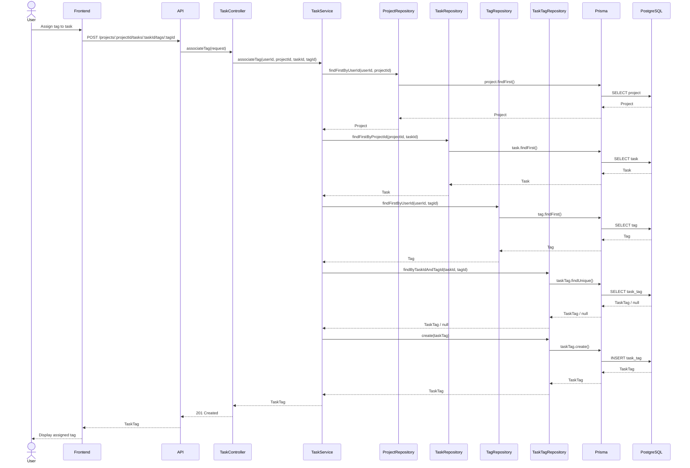

# Assign Tag to Task

```mermaid
sequenceDiagram

    actor User
    participant Frontend
    participant API
    participant TaskController
    participant TaskService
    participant ProjectRepository
    participant TaskRepository
    participant TagRepository
    participant TaskTagRepository
    participant Prisma
    participant PostgreSQL

    User->>Frontend: Assign tag to task

    Frontend->>API: POST /projects/:projectId/tasks/:taskId/tags/:tagId
    API->>TaskController: associateTag(request)

    TaskController->>TaskService: associateTag(userId, projectId, taskId, tagId)

    TaskService->>ProjectRepository: findFirstByUserId(userId, projectId)
    ProjectRepository->>Prisma: project.findFirst()
    Prisma->>PostgreSQL: SELECT project
    PostgreSQL-->>Prisma: Project
    Prisma-->>ProjectRepository: Project
    ProjectRepository-->>TaskService: Project

    TaskService->>TaskRepository: findFirstByProjectId(projectId, taskId)
    TaskRepository->>Prisma: task.findFirst()
    Prisma->>PostgreSQL: SELECT task
    PostgreSQL-->>Prisma: Task
    Prisma-->>TaskRepository: Task
    TaskRepository-->>TaskService: Task

    TaskService->>TagRepository: findFirstByUserId(userId, tagId)
    TagRepository->>Prisma: tag.findFirst()
    Prisma->>PostgreSQL: SELECT tag
    PostgreSQL-->>Prisma: Tag
    Prisma-->>TagRepository: Tag
    TagRepository-->>TaskService: Tag

    TaskService->>TaskTagRepository: findByTaskIdAndTagId(taskId, tagId)
    TaskTagRepository->>Prisma: taskTag.findUnique()
    Prisma->>PostgreSQL: SELECT task_tag
    PostgreSQL-->>Prisma: TaskTag / null
    Prisma-->>TaskTagRepository: TaskTag / null
    TaskTagRepository-->>TaskService: TaskTag / null

    TaskService->>TaskTagRepository: create(taskTag)
    TaskTagRepository->>Prisma: taskTag.create()
    Prisma->>PostgreSQL: INSERT task_tag
    PostgreSQL-->>Prisma: TaskTag
    Prisma-->>TaskTagRepository: TaskTag
    TaskTagRepository-->>TaskService: TaskTag

    TaskService-->>TaskController: TaskTag
    TaskController-->>API: 201 Created
    API-->>Frontend: TaskTag
    Frontend-->>User: Display assigned tag
```
