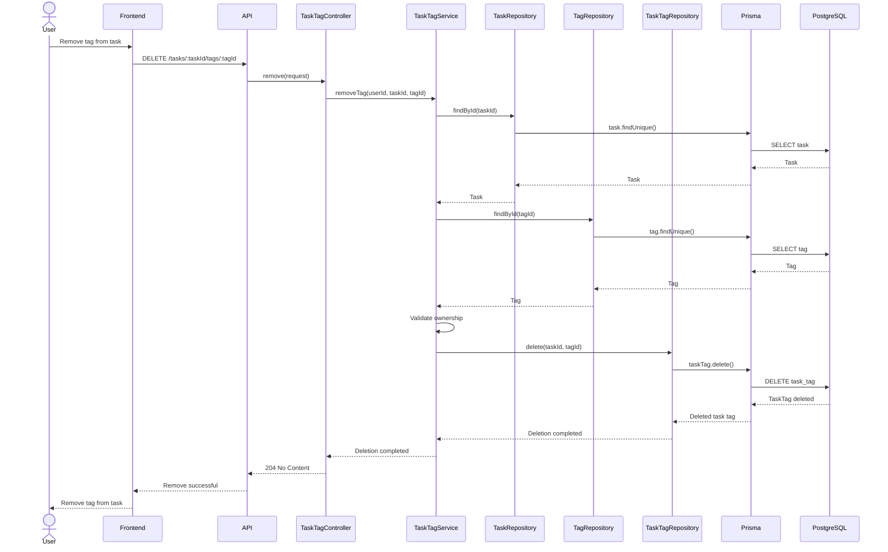

# Sequence Diagram - Remove Tag from Task

```mermaid
sequenceDiagram

    actor User

    participant Frontend

    participant API

    participant TaskTagController

    participant TaskTagService

    participant TaskRepository

    participant TagRepository

    participant TaskTagRepository

    participant Prisma

    participant PostgreSQL

    User->>Frontend: Remove tag from task

    Frontend->>API: DELETE /tasks/:taskId/tags/:tagId

    API->>TaskTagController: remove(request)

    TaskTagController->>TaskTagService: removeTag(userId, taskId, tagId)

    TaskTagService->>TaskRepository: findById(taskId)

    TaskRepository->>Prisma: task.findUnique()

    Prisma->>PostgreSQL: SELECT task

    PostgreSQL-->>Prisma: Task

    Prisma-->>TaskRepository: Task

    TaskRepository-->>TaskTagService: Task

    TaskTagService->>TagRepository: findById(tagId)

    TagRepository->>Prisma: tag.findUnique()

    Prisma->>PostgreSQL: SELECT tag

    PostgreSQL-->>Prisma: Tag

    Prisma-->>TagRepository: Tag

    TagRepository-->>TaskTagService: Tag

    TaskTagService->>TaskTagService: Validate ownership

    TaskTagService->>TaskTagRepository: delete(taskId, tagId)

    TaskTagRepository->>Prisma: taskTag.delete()

    Prisma->>PostgreSQL: DELETE task_tag

    PostgreSQL-->>Prisma: TaskTag deleted

    Prisma-->>TaskTagRepository: Deleted task tag

    TaskTagRepository-->>TaskTagService: Deletion completed

    TaskTagService-->>TaskTagController: Deletion completed

    TaskTagController-->>API: 204 No Content

    API-->>Frontend: Remove successful

    Frontend-->>User: Remove tag from task
```
