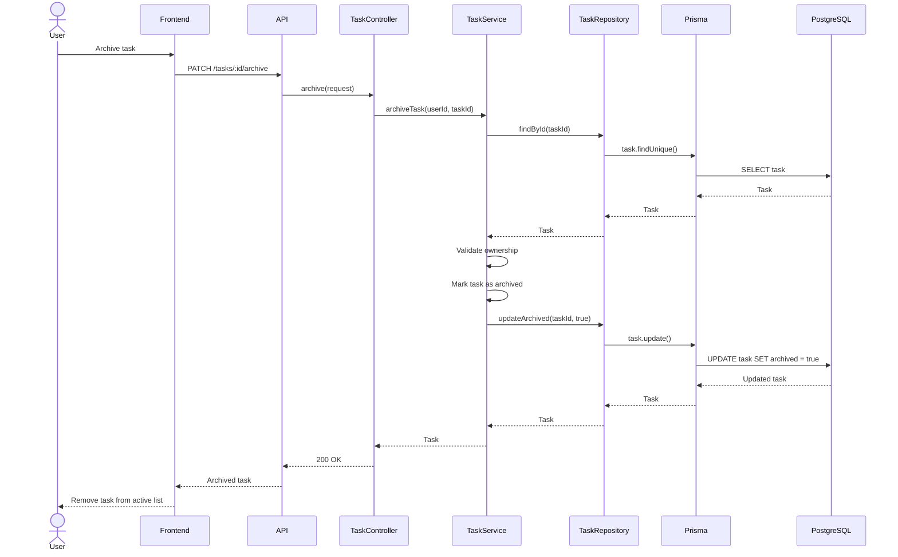

# Sequence Diagram - Archive Task

```mermaid
sequenceDiagram

    actor User

    participant Frontend

    participant API

    participant TaskController

    participant TaskService

    participant TaskRepository

    participant Prisma

    participant PostgreSQL

    User->>Frontend: Archive task

    Frontend->>API: PATCH /tasks/:id/archive

    API->>TaskController: archive(request)

    TaskController->>TaskService: archiveTask(userId, taskId)

    TaskService->>TaskRepository: findById(taskId)

    TaskRepository->>Prisma: task.findUnique()

    Prisma->>PostgreSQL: SELECT task

    PostgreSQL-->>Prisma: Task

    Prisma-->>TaskRepository: Task

    TaskRepository-->>TaskService: Task

    TaskService->>TaskService: Validate ownership

    TaskService->>TaskService: Mark task as archived

    TaskService->>TaskRepository: updateArchived(taskId, true)

    TaskRepository->>Prisma: task.update()

    Prisma->>PostgreSQL: UPDATE task SET archived = true

    PostgreSQL-->>Prisma: Updated task

    Prisma-->>TaskRepository: Task

    TaskRepository-->>TaskService: Task

    TaskService-->>TaskController: Task

    TaskController-->>API: 200 OK

    API-->>Frontend: Archived task

    Frontend-->>User: Remove task from active list
```
