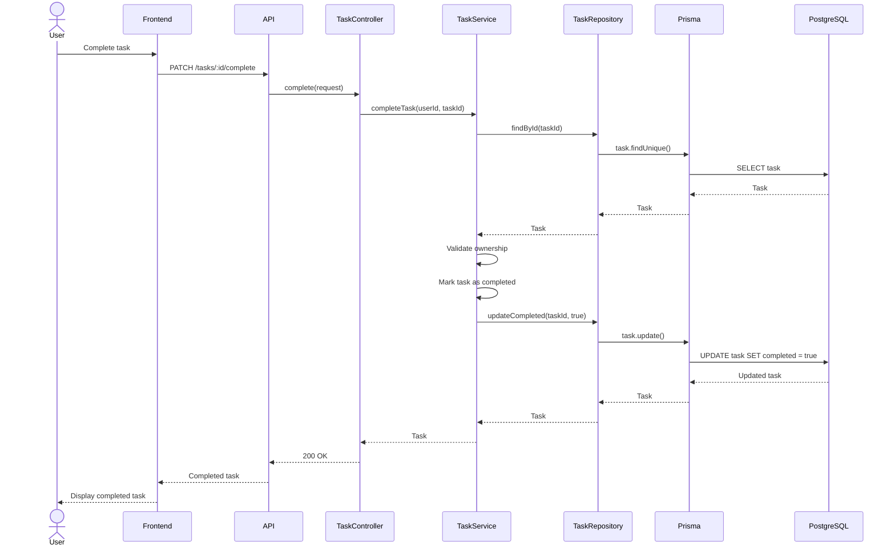

# Sequence Diagram - Complete Task

```mermaid
sequenceDiagram

    actor User

    participant Frontend

    participant API

    participant TaskController

    participant TaskService

    participant TaskRepository

    participant Prisma

    participant PostgreSQL

    User->>Frontend: Complete task

    Frontend->>API: PATCH /tasks/:id/complete

    API->>TaskController: complete(request)

    TaskController->>TaskService: completeTask(userId, taskId)

    TaskService->>TaskRepository: findById(taskId)

    TaskRepository->>Prisma: task.findUnique()

    Prisma->>PostgreSQL: SELECT task

    PostgreSQL-->>Prisma: Task

    Prisma-->>TaskRepository: Task

    TaskRepository-->>TaskService: Task

    TaskService->>TaskService: Validate ownership

    TaskService->>TaskService: Mark task as completed

    TaskService->>TaskRepository: updateCompleted(taskId, true)

    TaskRepository->>Prisma: task.update()

    Prisma->>PostgreSQL: UPDATE task SET completed = true

    PostgreSQL-->>Prisma: Updated task

    Prisma-->>TaskRepository: Task

    TaskRepository-->>TaskService: Task

    TaskService-->>TaskController: Task

    TaskController-->>API: 200 OK

    API-->>Frontend: Completed task

    Frontend-->>User: Display completed task
```
