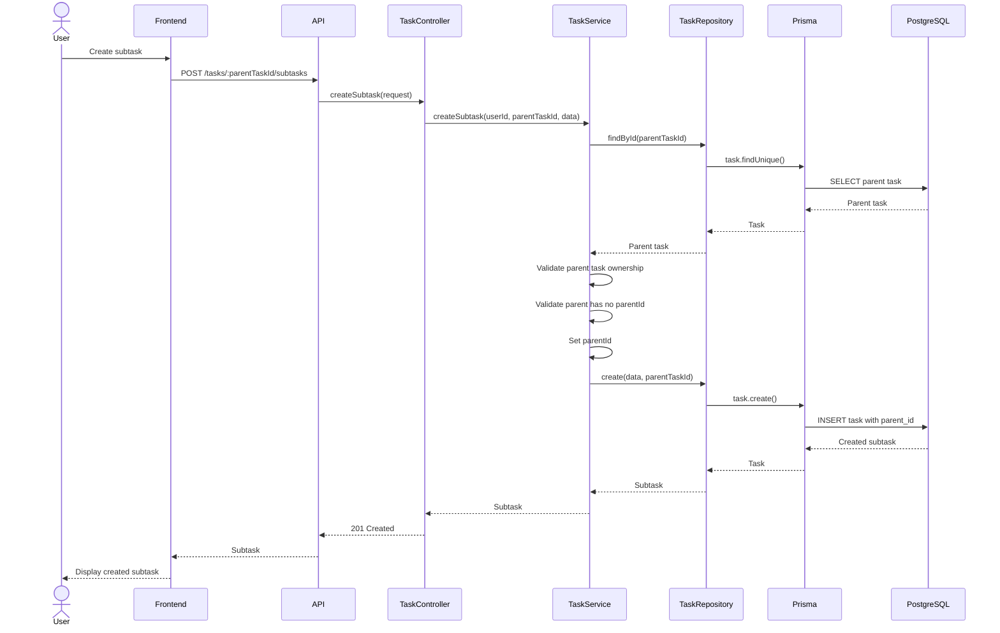

# Sequence Diagram - Create Subtask

```mermaid
sequenceDiagram

    actor User

    participant Frontend

    participant API

    participant TaskController

    participant TaskService

    participant TaskRepository

    participant Prisma

    participant PostgreSQL

    User->>Frontend: Create subtask

    Frontend->>API: POST /tasks/:parentTaskId/subtasks

    API->>TaskController: createSubtask(request)

    TaskController->>TaskService: createSubtask(userId, parentTaskId, data)

    TaskService->>TaskRepository: findById(parentTaskId)

    TaskRepository->>Prisma: task.findUnique()

    Prisma->>PostgreSQL: SELECT parent task

    PostgreSQL-->>Prisma: Parent task

    Prisma-->>TaskRepository: Task

    TaskRepository-->>TaskService: Parent task

    TaskService->>TaskService: Validate parent task ownership

    TaskService->>TaskService: Validate parent has no parentId

    TaskService->>TaskService: Set parentId

    TaskService->>TaskRepository: create(data, parentTaskId)

    TaskRepository->>Prisma: task.create()

    Prisma->>PostgreSQL: INSERT task with parent_id

    PostgreSQL-->>Prisma: Created subtask

    Prisma-->>TaskRepository: Task

    TaskRepository-->>TaskService: Subtask

    TaskService-->>TaskController: Subtask

    TaskController-->>API: 201 Created

    API-->>Frontend: Subtask

    Frontend-->>User: Display created subtask
```
