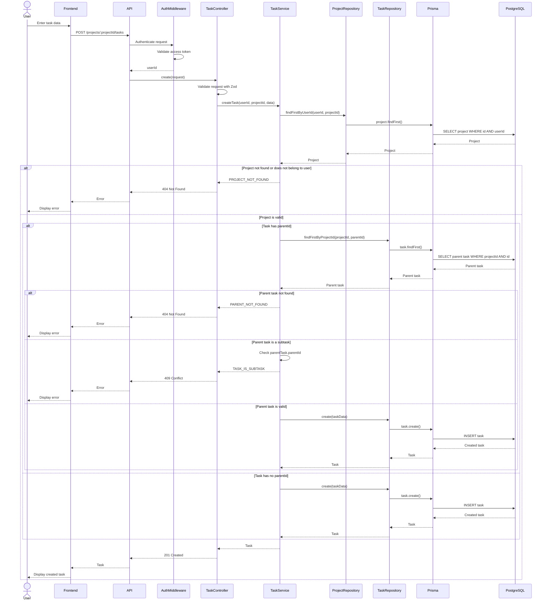

# Task - Create

```mermaid
sequenceDiagram

    actor User

    participant Frontend
    participant API
    participant AuthMiddleware
    participant TaskController
    participant TaskService
    participant ProjectRepository
    participant TaskRepository
    participant Prisma
    participant PostgreSQL

    User->>Frontend: Enter task data

    Frontend->>API: POST /projects/:projectId/tasks

    API->>AuthMiddleware: Authenticate request

    AuthMiddleware->>AuthMiddleware: Validate access token

    AuthMiddleware-->>API: userId

    API->>TaskController: create(request)

    TaskController->>TaskController: Validate request with Zod

    TaskController->>TaskService: createTask(userId, projectId, data)

    TaskService->>ProjectRepository: findFirstByUserId(userId, projectId)

    ProjectRepository->>Prisma: project.findFirst()

    Prisma->>PostgreSQL: SELECT project WHERE id AND userId

    PostgreSQL-->>Prisma: Project

    Prisma-->>ProjectRepository: Project

    ProjectRepository-->>TaskService: Project

    alt Project not found or does not belong to user

        TaskService-->>TaskController: PROJECT_NOT_FOUND

        TaskController-->>API: 404 Not Found

        API-->>Frontend: Error

        Frontend-->>User: Display error

    else Project is valid

        alt Task has parentId

            TaskService->>TaskRepository: findFirstByProjectId(projectId, parentId)

            TaskRepository->>Prisma: task.findFirst()

            Prisma->>PostgreSQL: SELECT parent task WHERE projectId AND id

            PostgreSQL-->>Prisma: Parent task

            Prisma-->>TaskRepository: Parent task

            TaskRepository-->>TaskService: Parent task

            alt Parent task not found

                TaskService-->>TaskController: PARENT_NOT_FOUND

                TaskController-->>API: 404 Not Found

                API-->>Frontend: Error

                Frontend-->>User: Display error

            else Parent task is a subtask

                TaskService->>TaskService: Check parentTask.parentId

                TaskService-->>TaskController: TASK_IS_SUBTASK

                TaskController-->>API: 409 Conflict

                API-->>Frontend: Error

                Frontend-->>User: Display error

            else Parent task is valid

                TaskService->>TaskRepository: create(taskData)

                TaskRepository->>Prisma: task.create()

                Prisma->>PostgreSQL: INSERT task

                PostgreSQL-->>Prisma: Created task

                Prisma-->>TaskRepository: Task

                TaskRepository-->>TaskService: Task

            end

        else Task has no parentId

            TaskService->>TaskRepository: create(taskData)

            TaskRepository->>Prisma: task.create()

            Prisma->>PostgreSQL: INSERT task

            PostgreSQL-->>Prisma: Created task

            Prisma-->>TaskRepository: Task

            TaskRepository-->>TaskService: Task

        end

        TaskService-->>TaskController: Task

        TaskController-->>API: 201 Created

        API-->>Frontend: Task

        Frontend-->>User: Display created task

    end
```
