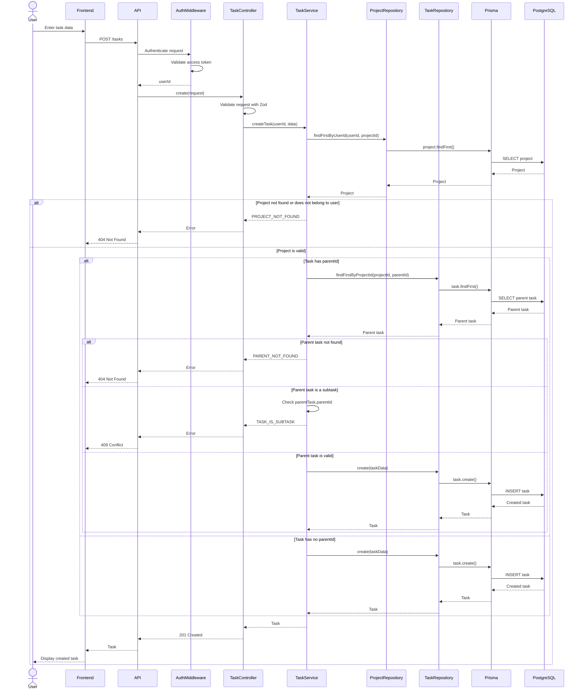

# Task - Create

```mermaid
sequenceDiagram

    actor User

    participant Frontend
    participant API
    participant AuthMiddleware
    participant TaskController
    participant TaskService
    participant ProjectRepository
    participant TaskRepository
    participant Prisma
    participant PostgreSQL

    User->>Frontend: Enter task data

    Frontend->>API: POST /tasks

    API->>AuthMiddleware: Authenticate request
    AuthMiddleware->>AuthMiddleware: Validate access token
    AuthMiddleware-->>API: userId

    API->>TaskController: create(request)

    TaskController->>TaskController: Validate request with Zod

    TaskController->>TaskService: createTask(userId, data)

    TaskService->>ProjectRepository: findFirstByUserId(userId, projectId)
    ProjectRepository->>Prisma: project.findFirst()
    Prisma->>PostgreSQL: SELECT project
    PostgreSQL-->>Prisma: Project
    Prisma-->>ProjectRepository: Project
    ProjectRepository-->>TaskService: Project

    alt Project not found or does not belong to user
        TaskService-->>TaskController: PROJECT_NOT_FOUND
        TaskController-->>API: Error
        API-->>Frontend: 404 Not Found
    else Project is valid

        alt Task has parentId

            TaskService->>TaskRepository: findFirstByProjectId(projectId, parentId)
            TaskRepository->>Prisma: task.findFirst()
            Prisma->>PostgreSQL: SELECT parent task
            PostgreSQL-->>Prisma: Parent task
            Prisma-->>TaskRepository: Parent task
            TaskRepository-->>TaskService: Parent task

            alt Parent task not found
                TaskService-->>TaskController: PARENT_NOT_FOUND
                TaskController-->>API: Error
                API-->>Frontend: 404 Not Found
            else Parent task is a subtask
                TaskService->>TaskService: Check parentTask.parentId

                TaskService-->>TaskController: TASK_IS_SUBTASK
                TaskController-->>API: Error
                API-->>Frontend: 409 Conflict
            else Parent task is valid
                TaskService->>TaskRepository: create(taskData)
                TaskRepository->>Prisma: task.create()
                Prisma->>PostgreSQL: INSERT task
                PostgreSQL-->>Prisma: Created task
                Prisma-->>TaskRepository: Task
                TaskRepository-->>TaskService: Task
            end

        else Task has no parentId

            TaskService->>TaskRepository: create(taskData)
            TaskRepository->>Prisma: task.create()
            Prisma->>PostgreSQL: INSERT task
            PostgreSQL-->>Prisma: Created task
            Prisma-->>TaskRepository: Task
            TaskRepository-->>TaskService: Task

        end

        TaskService-->>TaskController: Task
        TaskController-->>API: 201 Created
        API-->>Frontend: Task
        Frontend-->>User: Display created task

    end
```
