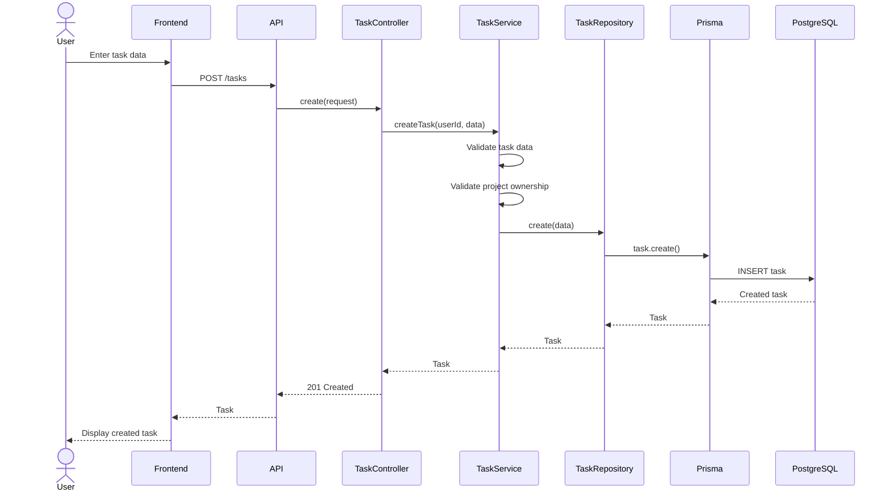

# Sequence Diagram - Task - Create

```mermaid
sequenceDiagram

    actor User

    participant Frontend

    participant API

    participant TaskController

    participant TaskService

    participant TaskRepository

    participant Prisma

    participant PostgreSQL

    User->>Frontend: Enter task data

    Frontend->>API: POST /tasks

    API->>TaskController: create(request)

    TaskController->>TaskService: createTask(userId, data)

    TaskService->>TaskService: Validate task data

    TaskService->>TaskService: Validate project ownership

    TaskService->>TaskRepository: create(data)

    TaskRepository->>Prisma: task.create()

    Prisma->>PostgreSQL: INSERT task

    PostgreSQL-->>Prisma: Created task

    Prisma-->>TaskRepository: Task

    TaskRepository-->>TaskService: Task

    TaskService-->>TaskController: Task

    TaskController-->>API: 201 Created

    API-->>Frontend: Task

    Frontend-->>User: Display created task
```
